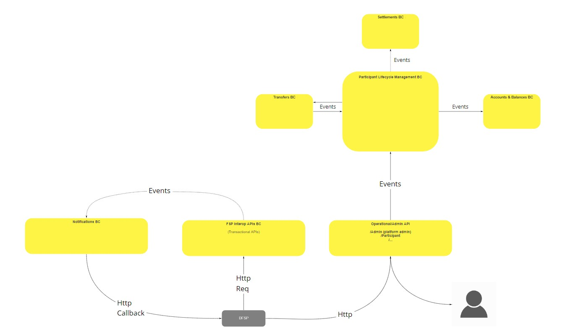
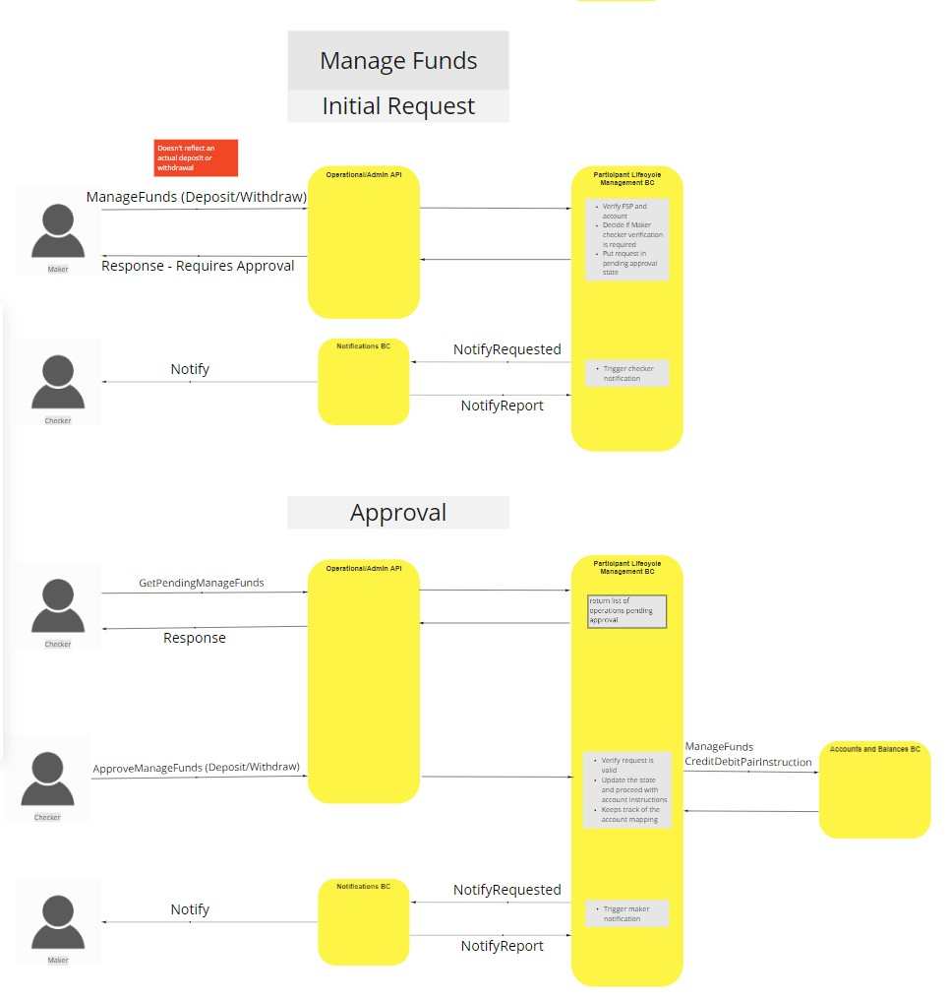
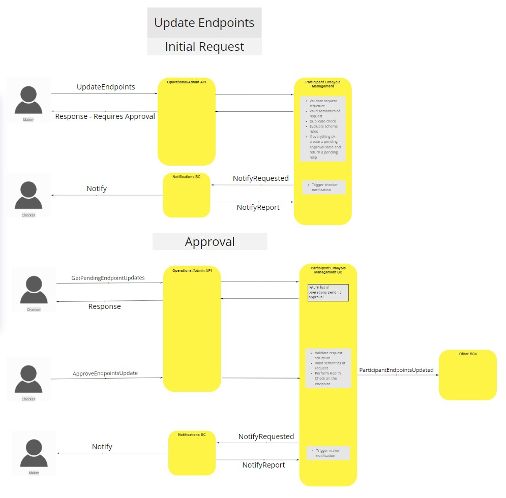
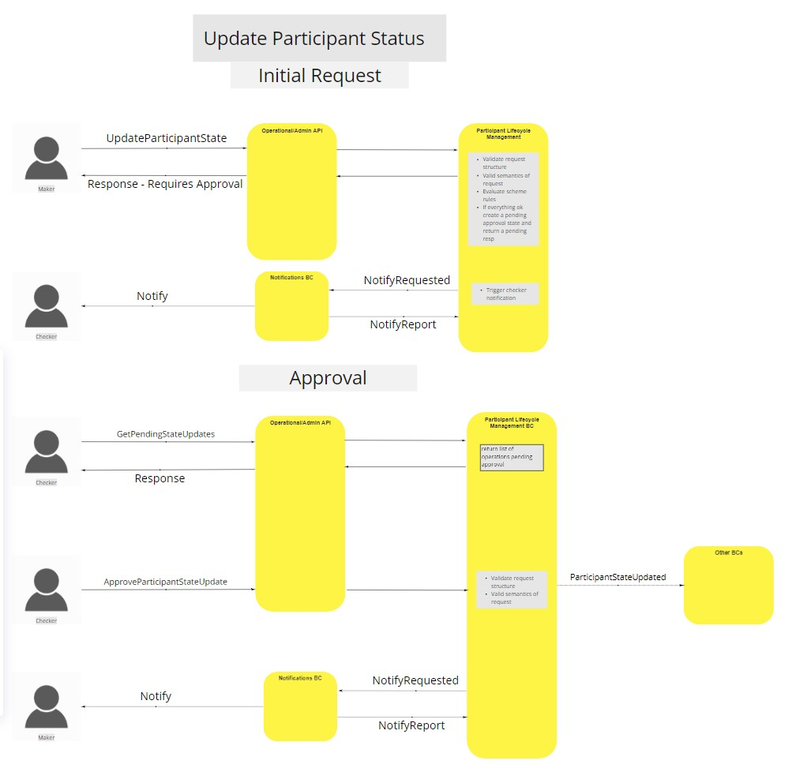
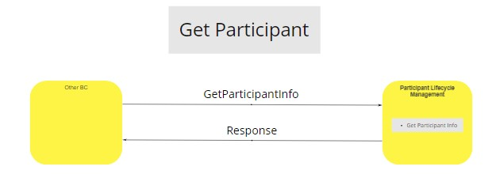
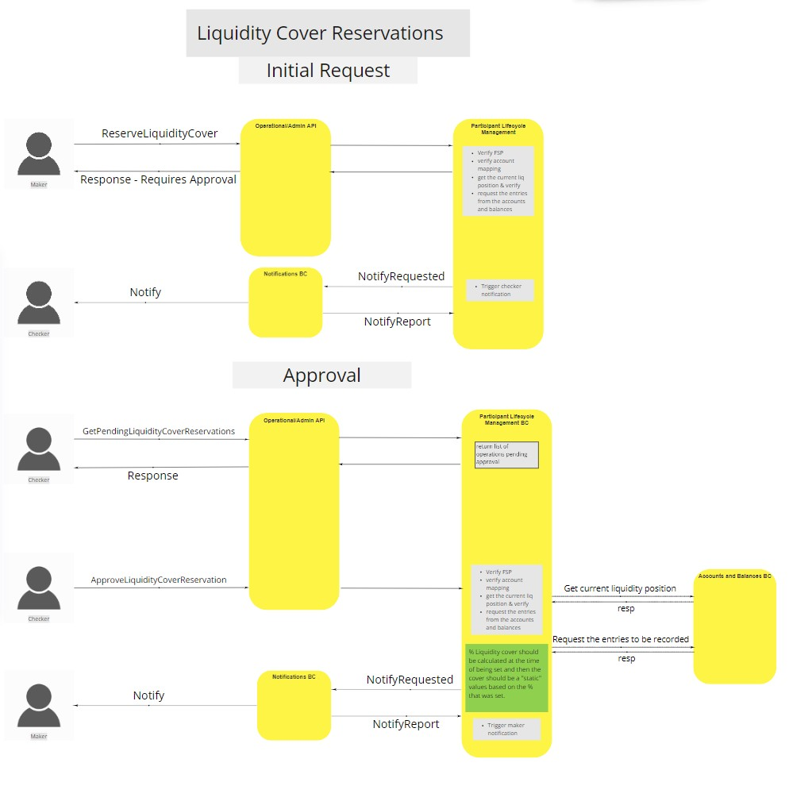
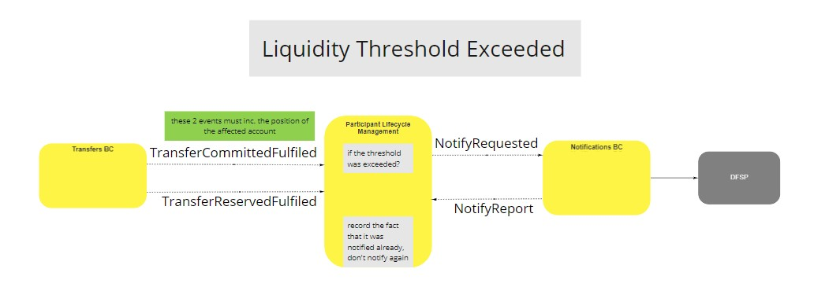
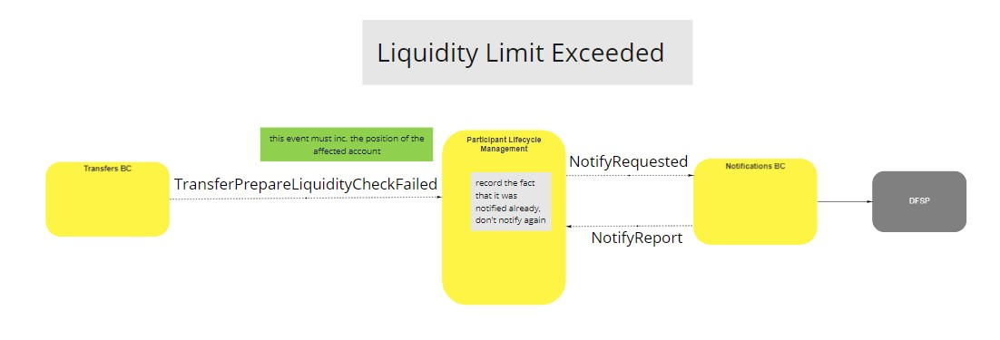
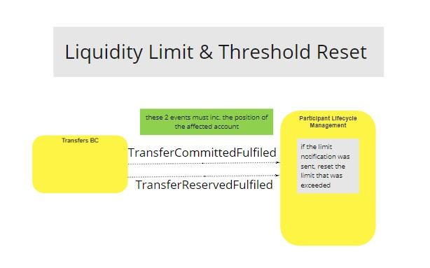

# Participant Lifecycle Management BC

The Participant Lifecycle Bounded Context's primary concern regards anything to do with the management of a Participant within the Mojaloop Environment. When we are defining the Participant Lifecycle Management Bounded Context there are a few key concepts that should be clearly defined.

#### Maker-Checker Process
The Maker-Checker Process establishes the 6 eye verification and ensure that no write action takes place without being validated by some one with adiquite permissions. These permissions are defined by the Participant Lifecycle Management Bounded Context but are configurable and assignable as needed by the Scheme Rules. It is recommended that the users/roles that receive the maker permissions do not receive the checker permissions, and that the checker permissions are assigned to different users/roles. It will still be possible to assign both responsibilities to the same users/roles but this then voids the security that is provided by the maker-checker process that the system was built to support.

#### Participant States
The participant state management allows the admin operators to control permissions for a given participant based on their state. During the Platform Configuration phase, the Participant Lifecycle Management Bounded Context expects participant states to be defined and configured with either roles/permissions. The participant states can then be assigned to a given participant through the Participant Status Management process.

## Terms

Terms with specific and commonly accepted meaning within the Bounded Context in which they are used.

| Term        | Description  |
| ----------- | ------------ |
| **Participant** | Financial Service Provider that register on the Mojaloop ecosystem. Allowing said FSP to be able to transact with other Participants |
| **Maker**       | Representative that is responsible for creating data structures through the use of request.   |
| **Checker**     | Representative that is responsible for approving and accepting data that has been requested to be created. |

## Functional Overview

Please review the common interfaces page to see how these interaction take place. [^1]

>

## Use Cases

### Create Participant (Single Step Registration)

#### Description

Process to create a Participant on the Mojaloop ecosystem, this usually requires all the information that relates to the participant and the initial accounts needed.

#### Flow Diagram

>

### Manage Funds

#### Description

Process to either withdraw or deposit funds to the Participant's account(s).

#### Flow Diagram

>

### Update Endpoints

#### Description

Updates the endpoint of a given participant, when the request has been approved the endpoint will be called on a keep alive path to ensure connectivity.

#### Flow Diagram

>

### Update Participant Status

#### Description

Changes the Status of a given participant to enforce different roles/scheme rules on the participant.

#### Flow Diagram

>

### Get Participant

#### Description

Gets information with about a given participant.

#### Flow Diagram

>

### Participant Accounts

#### Description

These process controls different aspects of a Participant's accounts, from creating an account, enabling/disabling and update the limits and threshold warnings of an account. sub-processes included in this use case are:

-   Add Participant Account
-   Update Participant Account Status (Enable/Disable)
-   Update Liquidity Limits and Warning Thresholds

#### Flow Diagram

>

### Reserve Liquidity Cover

#### Description

Reserves liquidity cover for a Participant and notifies the Accounts and Balances BC about the changes.

#### Flow Diagram

>

### Liquidity Threshold Exceeded

#### Description

This process notifies the participant that the liquidity threshold,that has been set beforehand, has been reach and action might be required.

#### Flow Diagram

>

### Liquidity Limit Exceeded

#### Description

This process notifies the participant when ha reached the liquidity limit that was set.

#### Flow Diagram

>

### Liquidity Threshold & Limit Reset

#### Description

This process resets the liquidity limit or threshold notification checks when successful transfers have been executed and the position is in a positive state.

#### Flow Diagram

>

### Liquidity Cover Queries

#### Description

Queries to check the current liquidity as well as other read operations that are related to Liquidity.

#### Flow Diagram

>

## Canonical Model

-   Participant
    -   id
    -   participantAlias
    -   endpointURL
    -   state
    -   Accounts[]
        -   accountID
        -   ledgerAccountType
        -   accountCurrency
        -   isActive
        -   warningThreshold
        -   limit
            -   type
            -   value

## Concluding Comments

**Participant Accounts:** Participants can only have one account per allowed currency.
**Update Position Use Case:** Has been changed to the Manage Funds use case
**Maker/Checker Operations:** Retry count has no effect on the way we process/re-process requests.

<!-- Footnotes themselves at the bottom. -->

## Notes

[^1]: Common Interfaces: [Mojaloop Common Interface List](../../commonInterfaces.md)
