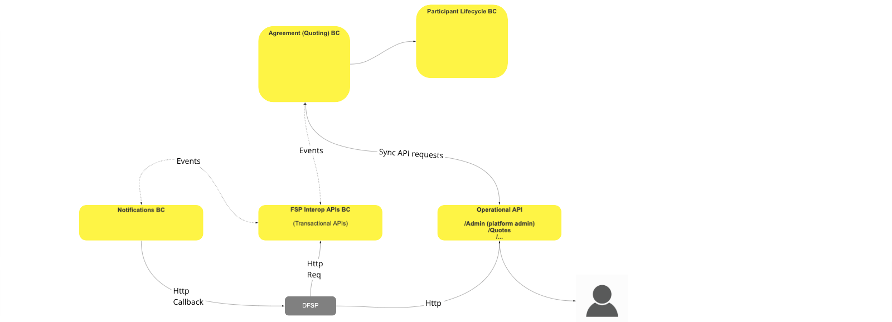
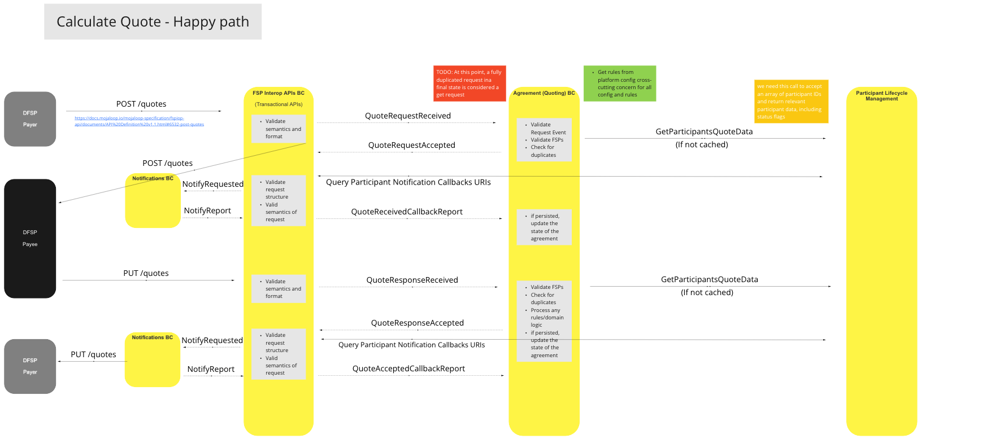
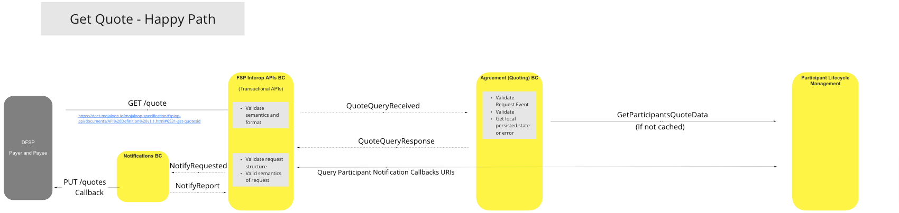
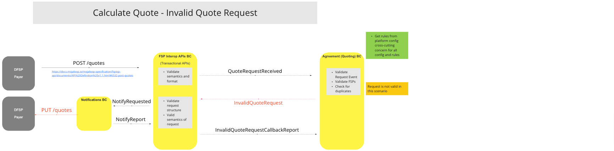
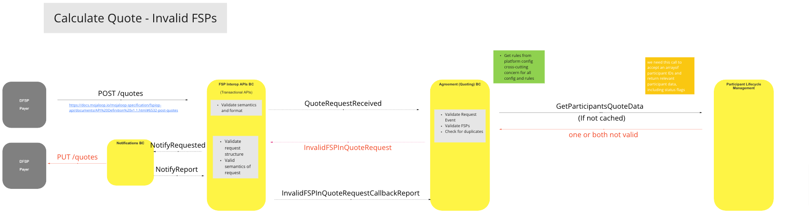
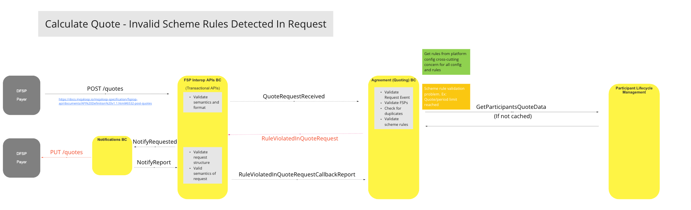
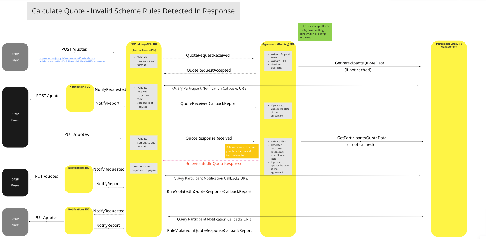

# Quoting/Agreements BC

The Quoting and Agreements Bounded Context provides Participants with quotations for undertaking transfers, and records the participant accept/reject responses.

## Terms

The following terms are used in this BC, also known as a domain.

| Term | Description |
|---|---|
| **DFSP** | Digital Financial Services Provider |
| **Participant** | Financial Services Provider |

## Functional Overview

> BC Function Diagram: Quoting/Agreements Overview

## Use Cases

### Calculate Quote - Happy Path

#### Description

This process obtains an array of relevant Participant data including status flags, calculates the cost of Transfer including fees, and provides it to the Participant/s.  It also able to support the storing of Participants requests & responses (i.e. accept or reject the quote).

#### Flow Diagram

> UC Flow Diagram: Calculate Quote - Happy Path

### Get Quote - Happy Path

#### Description

Process to obtain and deliver existing Quote details to Participant/s on request.

#### Flow Diagram

> UC Workflow Diagram: Get Quote - Happy Path

### Calculate Quote - Invalid Quote Request

#### Description

Process that enables the system to invalidate quote requests by monitoring and responding to invalid Request Events, FSPs, or duplicate requests.

#### Flow Diagram

> UC Workflow Diagram: Calculate Quote - Invalid Quote Request

### Calculate Quote - Invalid FSPs

#### Description

Process that enables the system to invalidate FSP quote requests where the FSP details mismatch the original Quote for either one or both Participants.

#### Flow Diagram

> UC Workflow Diagram: Calculate Quote - Invalid FSPs

### Calculate Quote - Invalid Scheme Rules Detected In Request

#### Description

Process to enable the system to invalidate quote requests where Scheme Rules are violated, by one or more Participants, for example where Quote Period Limit reached.

#### Flow Diagram

> UC Workflow Diagram: Calculate Quote - Invalid Scheme Rules Detected In Request

### Calculate Quote - Invalid Scheme Rules Detected In Response

#### Desciption

Process to enable the system to invalidate quote reponses where Scheme Rules are violated by one or more Participants, for example, where invalid terms are detected.

#### Flow Diagram

> UC Workflow Diagram: Calculate Quote - Invalid Scheme Rules Detected In Response

## Canonical Quote Model

The canonical model stores the following details of quotations in the Quotes & Agreements BC:

- Quote ID
- Transaction ID
- Participants
  - payerId
  - payeeId
- Payer
  - Participant
    - participantId
    - roleType (e.g. payer)
  - Amount Requested (initial amount)
    - Value (number)
    - Currency (ISO currency code)
  - Amount to send (including fees, etc.)
    - Value (number)
    - Currency (ISO currency code)
- Payee(s) (one or more - should all be added to the "Amount to send")
  - '#'
    - Participant
      - participantId
      - roleType (Identify why this "payee" is receiving this amount, i.e.: fee, recipient, etc.)
      - reason
      - Amount to receive
        - value (number)
        - currency (ISO currency code)
- Extensions

## Concluding comments

- No red flag issues have been observed in the overall BC and Reference Architecture design.
- We need to better understand/clarify the "GET" via "POST" pattern:
  - Should a "GET" event be a simple Restful "GET", or does the system need to support the "GET" from duplicate posts?
  - Are we required to serve "GET" requests that include FSP details at a later date?

<!--## Notes -->

<!-- Footnotes themselves at the bottom. -->
[^1]: Common Interfaces: [Mojaloop Common Interface List](../../commonInterfaces.md)
