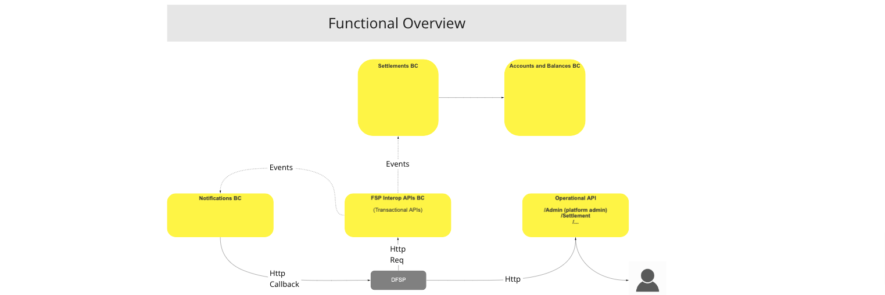
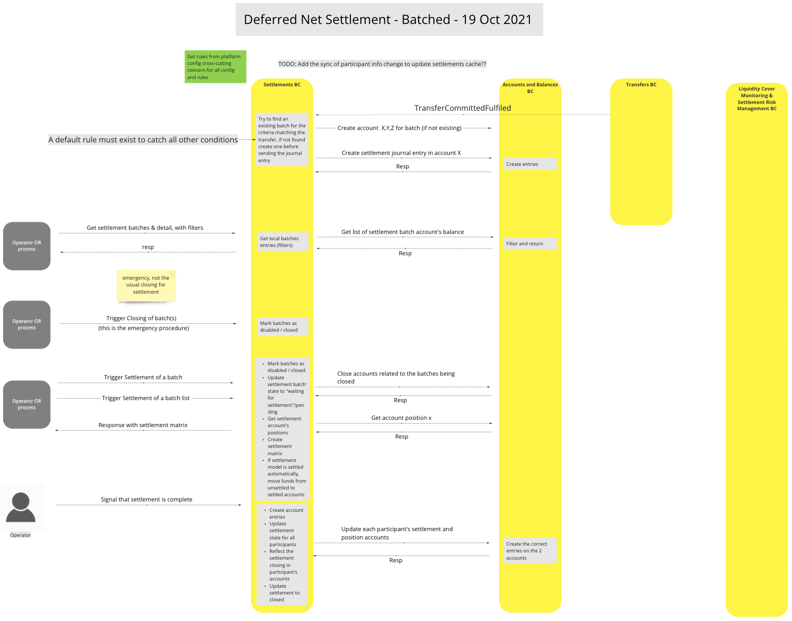
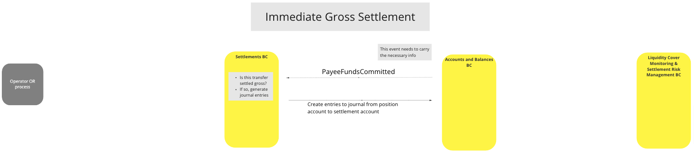
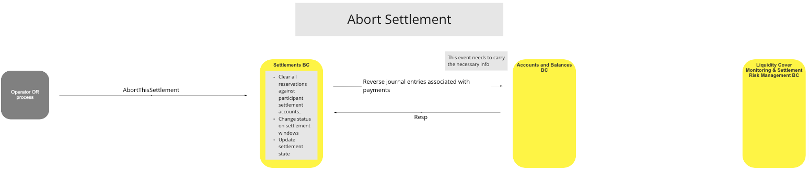
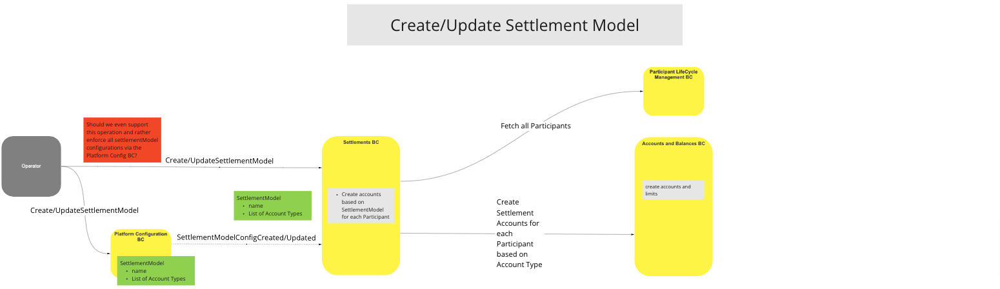
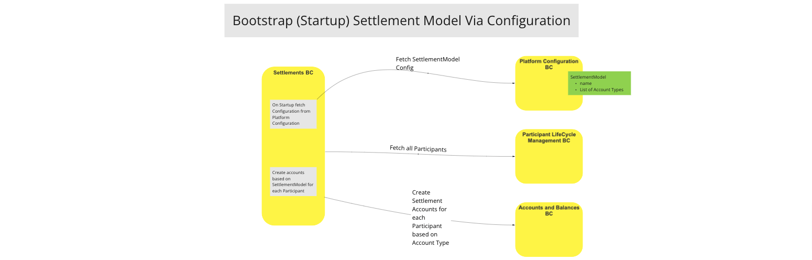

# Settlements BC

The Settlements BC is integral to settling Participant transfers using either Deferred Net Settlement (DNS) [^1] or Immediate Gross Settlement (IGS) [^2] methods. It is responsible for creating settlement windows, identifying and deploying the required settlement method (DNS/IGS), settling, closing, and updating batches, and recording all deposits and withdrawals to the appropriate ledger accounts in the Accounts and Balances BC.  In the instance where new participants are transacting to the first time, this BC also initiates creation of the appropriate Ledger Accounts in the Accounts and Balances BC where necessary.

## Terms

The following terms are used in this BC, also known as a domain.

| Term     | Description  |
| -------- | ------------ |
| **DNS** | Deferred Net Settlement [^1] |
| **IGS** | Immediate Gross Settlement [^2] |
| **Operator** | Person or System issuing instructions/requests |
| **Participant** | FSP/PISP or FSP Customer |
| **Account** | Ledger Journal Account (Cr/Dr) |

## Functional Overview

> BC Functional Overview Workflow Diagram

## Use Cases

### Deferred Net Settlement (DNS) [^1]

#### Description
This UC Workflow provides the BC with a method of deferring payments to enable settlement on multiple batches according a predetermined schedule.  This is useful for environments involving multiple Participants to a transaction requiring a balance of payment due settlement approach.

#### Flow Diagram

>UC Workflow Diagram: Deferred Net Settlement [^1] - 19/10/2021

### Immediate Gross Settlement (IGS) [^2]

#### Description
This UC Workflow provides the BC with a method that enables individual transfers to be settled independently of each other. It doesn't specify how the settlements should occur.  This is useful for SME environments where quick settlement of transactions are desirable in order to maximize their liquidity.

#### Flow Diagram

>UC Workflow Diagram: Immediate Gross Settlement [^2]

### Abort Settlement

#### Description
This UC Workflow provides the BC with a method that enables the Settlement BC to abort a settlement as required, reversing Participant settlement accounts, updating the settlement status for settlement windows, and updating the settlement state.

#### Flow Diagram

> UC Workflow Diagram: Abort Settlement

### Create/Update the Settlement Model (DNS [^1]/IGS [^2])

#### Description
This UC Workflow provides the BC with a method that enables the Settlement BC to create or update the settlement method for a settlement batch based on the Participant Account Type.  Useful in instances where mixed Settlement Methods are required.

#### Flow Diagram

> UC Workflow Diagram: Create/Update Settlement Model (DNS/IGS)

### Bootstrap (Startup) Settlement Model via Configuration

#### Description
This UC Workflow provides the BC with a method that configures the Settlement Method (DNS/IGS) based upon the system startup configuration.  Useful in instances where all Settlement Models are the same, such as all DNS [^1], or all IGS [^2].

#### Flow Diagram

>UC Workflow Diagram: Bootstrap (Startup) Settlement Model via Configuration

### Create Settlement related accounts for newly created Particpants

#### Description
This UC Workflow provides the BC with a method to create settlement accounts for new Participants to enable fund transfers to be managed by the Switch.  An additional benefit to this UC Workflow is that it enables the Switch to exercise end-to-end management of all transfers irrespective of settlement method.

#### Flow Diagram

> UC Workflow Diagram: Create Settlement-related Accounts for New Participants

<!-- Footnotes themselves at the bottom. -->
<!-- ## Notes -->

[^1]: Further reading: ["Deferred Net Settlement" from the Treasurer's Wiki, set up by the Association of Corporate Treasurer's](https://wiki.treasurers.org/wiki/Deferred_net_settlement)
[^2]: Further reading: ["Settlement Model", Mojaloop Business Operations Documentation: Scheme Guide, Settlement Model section](https://docs.mojaloop.io/mojaloop-business-docs/HubOperations/Settlement/settlement-basic-concepts.html#settlement-model)

[^3]: Common Interfaces: [Mojaloop Common Interface List](../../commonInterfaces.md)
