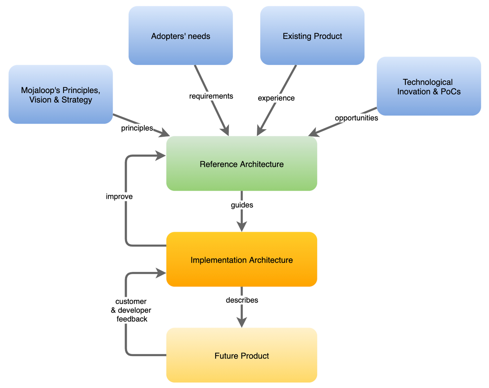

# Introduction

## What is a Reference Architecture?

In a software system, a Reference Architecture is a set of software design documents, that capture the essence of the product and provide guidance to its technical evolution.

This concept can be further simplified: 
_**The Reference Architecture is the architectural vision of the perfect design.**_

In normal conditions that perfect design is never achieved, partly because there is neither enough time nor resources to fully implement it, partly because that design can iterate and improve faster than it can be implemented. 
It is the nature of a Reference Architecture to be a living document that is continuously updated and enhanced.        

## Objectives
Its main objectives are to:
* Identify abstractions, interfaces and standardization opportunities
* Propose solution patterns to common problems
* Help enforcing technical design principles
* Provide guidance to the implementation architectures
* Forster innovation and contribution, by defining what can be done and how

## Benefits of having a Reference Architecture
The first benefit is that it is the perfect foundation for a Technical Roadmap. By having the future vision in perspective, a phased Technical Roadmap can easily be created from it, ensuring resources and attention are focused on the long term value.   

Another important benefit is the guidance it provides to decision-making regarding technology choices and implementation strategies. 
With the Reference Architecture in mind we can frame any development decision as tactical or strategic:
- Tactical - something that is required right now and might ignore the reference architecture for the sake of an urgent value.
- Strategic - something that is long-lasting and should be implemented in accordance to the Reference Architecture - should take the implementation closer to it.

Last but not less important, it ensures alignment between the technical vision and the more important product vision (see below regarding the process and ways of working).   

## Process of creating and maintaining the Reference Architecture

The Reference Architecture creation process has been guided by Domain-Driven Design[1] principles and the solution space heavily inspired by SOLID's[2] single responsibility principle (SRP).

The process of creating the initial version of the Reference Architecture followed these steps:
* Problem Space mapping - what are the different problem domains and subdomains, and how they are classified according to their importance 
* Solution Space Context mapping - grouping similar problems together based on their purpose and context
* Individual use case mapping - document use cases in detail taking into consideration the entire solution

### Problem Space mapping
This exercise allows us to understand the different problem domains and subdomains, and how they are classified according to their importance.
Considering that this initial version of the Reference Architecture focused exclusively on the Mojaloop Switch, we only have one domain. All internal problems are thus called problem subdomains.

According to DDD we classified some problem subdomains as:
* Core subdomains - we need to solve these problems ourselves to control the outcome. In practical terms, this is where we put the most effort. Examples are transfers, participant lifecycle management or keeping accounts and balances
* Supporting subdomains - these are problems that can’t be easily solved by using off-the-shelf software, we’ll need some coding effort to solve them, it’s not just integration. Examples of this are Authorization and Access Policies or Reporting
* Generic subdomains - these are usually problems that can be solved using of-the-shelf software, requiring only some integration effort. Examples are Authentication or Platform monitoring, we don’t need to code these solutions ourselves but we still to design accordingly

## How to keep it up-to-date
The diagram below shows where a reference architecture exists in reference to other processes of the Mojaloop Platform; what it must incorporate and understand, not only the vision and the principles, but also the requirements, previous experience and even forster technical innovation.

TBD

## Reference Architecture Artifacts

