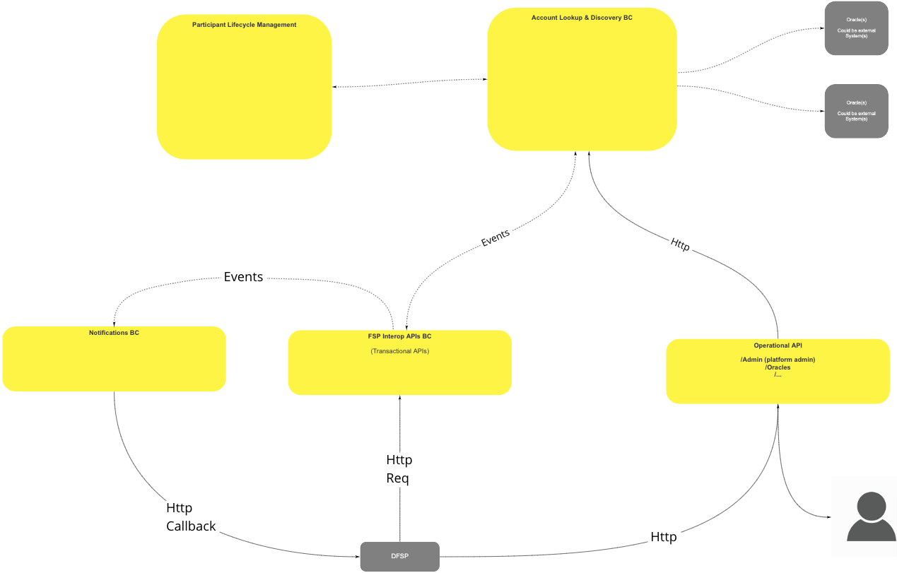
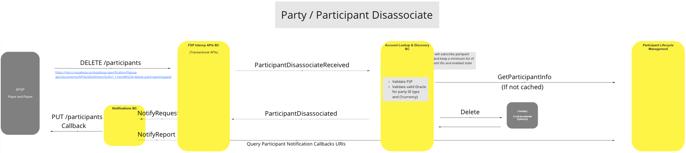

# Account Lookup And Discovery BC

No additional notes in work session document.

## Terms

The following terms are used in this BC, also known as a domain.

| Term | Description |
|---|---|
| Participant | Financial Services Provider |
| Party | FSP Customer |

## Functional Overview

>

## Use Cases

### Party/Participant Associate

#### Description

Associate transfer/s Participant/s and/or parties.

#### Flow Diagram

>

### Party/Participant Disassociate

#### Description

Disassociate transfer/s Participants and/or Parties.

#### Flow Diagram

>

### Get Participant

#### Description

Get transfer/s Participant/s details.

#### Flow Diagram

>

### Get Party

#### Description

Get transfer/s Party/s details.

#### Flow Diagram

>
## Canonical Quote Model

The canonical model stores the following details of quotations in the Quotes & Agreements BC:

 - Quote ID
 - Transaction ID
 - Participants
   - payerId
   - payeeId
 - Payer
   - Participant
     - participantId
     - roleType <-- payer
   - Amount Requested (initial amount)
     - Value (number)
     - Currency (ISO currency code)
    - Amount to send (including fees, etc.)
      - Value (number)
      - Currency (ISO currency code)
 - Payee(s) (one or more - should all be added to the "Amount to send")
   - '#'
     - Participant
       - participantId
       - roleType <-- Identify why this "payee" is receiving this amount, i.e.: fee, recipient, etc.
       - reason
       - Amount to receive
         - value (number)
         - currency (ISO currency code)
 - Extensions

## Concluding comments

 * No red flag issues have been observed in the overall BC and Reference Architecture design.
 * We need to better understand/calrify the "GET" via "POST" pattern:
   * Should a "GET" event be a simple Restful "GET", or does the system need to support the "GET" from duplicate posts?
   * Are we required to serve "GET" requests that include FSP details at a later date?

<!--## Notes -->
<!-- Footnotes themselves at the bottom. -->

[^1]: Common Interfaces: [Mojaloop Common Interface List](../../commonInterfaces.md)
