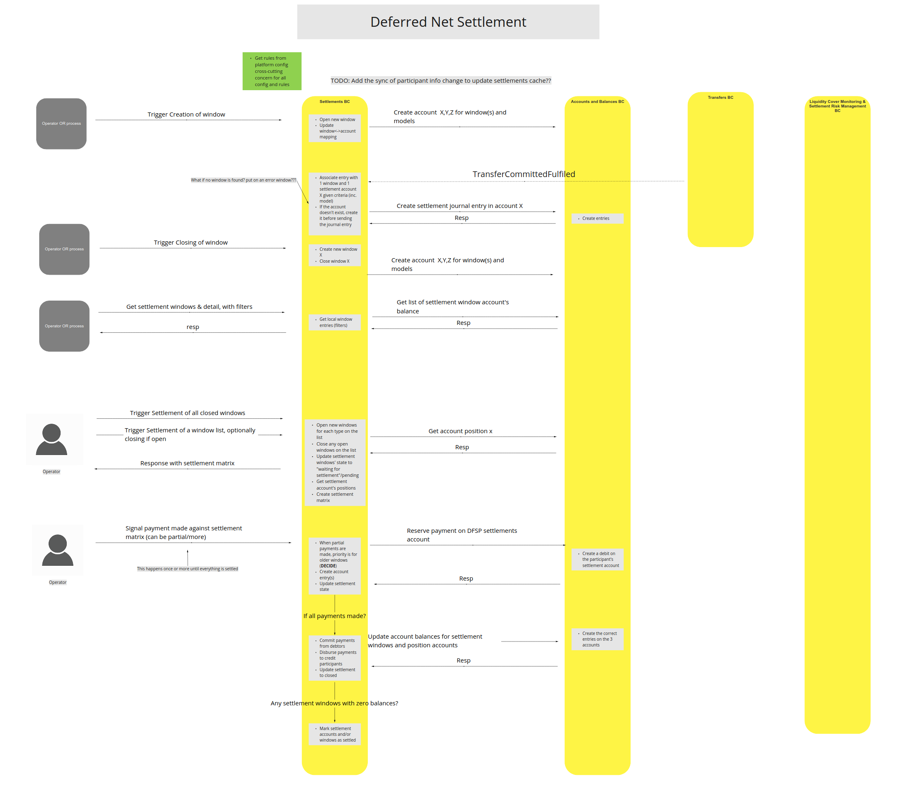

# Accounts and Balances BC

The Accounts and Balances BC acts as the "central ledger" for the system.  It interacts primarily with the Settlements and the Transfers BCs, and is a directed sub-system, which means that it is a dependency of the Settlements and Transfers BCs that use it as a "financial system of record" for the financial accounting.

**Note:** *The Accounts and Balances BC does not contain any Mojaloop business logic.  The only logic included in the BC is to ensure that when and external BC attempts to create new journal entries, that they do not cause an account balance to exceed its limits.*

## Terms

Terms with specific and commonly accepted meaning within the Bounded Context in which they are used.

| Term | Description |
|---|---|
| Account | Debit/Credit Ledger Account |
| Journal Entry | Credit/Debit financial records against Account | 

## Use Cases

### Create Account

#### Description

Create new participant/transfer/settlement account in the System Ledger.  Specify credit/debit Journal Entry limits. Ensure Account is unique in the System Ledger.

#### Flow Diagram
Account creation from [Participant Lifecycle Management BC](../participantLifecycleManagement/index.md).

###

Account creation from [Settlements BC](../settlements/index.md).

###

### Close Account

#### Description

Close a participant account in the System Ledger and prevent new journal entries from impacting it.  (Still to be determined: Drain collateral CR balances to another account atomically?)

### Query Account

#### Description

Query the status and balance for participant account.

#### Flow Diagram

Query liquidity CR/DR limits from [Participant Lifecycle Management BC](../participantLifecycleManagement/index.md).

### Query Journal Entries

#### Description

Query Journal debit/credit Entries for an Account.

### Insert Journal Entry

#### Description

Insert a participant journal entry into the System Ledger specifying the debit and credit accounts. Respond with the updated account balance.

#### Flow Diagram

Journal Entry insertion from [Transfers BC](../transfers/index.md).

###

Journal Entry insertion from [Settlements BC](../settlements/index.md) using `Deferred Net Settlement` (DNS) model.

### 

Journal Entry insertion from [Settlements BC](../settlements/index.md) using `Immediate Gross Settlement` (IGS) model.

## Cononical Model

- Account
    - accountId
    - ledgerAccountType
    - ledgerAccountState
    - debitLimit
    - creditLimit
    - debitBalance
    - creditBalance
- Journal Entry
  - journalEntryId
  - debitAccountId
  - creditAccountId
  - journalEntryType
  - transferAmount
  - transferTimestamp

<!-- Footnotes themselves at the bottom. -->
<!-- ## Notes -->

[^1]: Common Interfaces: [Mojaloop Common Interface List](../../commonInterfaces.md)
