# FSP Interoperability API BC

The FSP Interoperability API Bounded Context provides access to the internal operations and resources that the Mojaloop Ecosystem provides to a given Participant. This Bounded Context is responsible for providing a Participant with interfaces whit which the Participant can perform and execute tasks on Mojaloop. It is also responsible for providing communication back to the Participant regarding different notifications and system messages that a participant should expect to receive.

## Functional Overview

The FSP IOP API interacts with many different bounded contexts and thus the simplified view is provided here, for further reading on the events and connections that the FSP IOP API provides and consumes please review the Mojaloop Common Interfaces [^1].

> FSP Interoperability API Functional Overview

## Terms

Terms with specific and commonly accepted meaning within the Bounded Context in which they are used.

| Term        | Description                                                                                                                                                      |
| ----------- | ---------------------------------------------------------------------------------------------------------------------------------------------------------------- |
| Participant | Financial Service Provider (FSP) that has registered on the Mojaloop ecosystem. Allowing said FSP to be able to transact with other Participants                             |
| FSP IOP API | Financial Service Provider Interoperability Application Programming Interface, the API that provides access to functions and features of the Mojaloop Ecosystem. |
| DFSP        | Digital Financial Service Provider                                                                                                                               |

## Use Cases

Use case definitions [^2] have not been altered and the Reference Architecture allows for us to only change the background orchestration of the internal Mojaloop services and Bounded Contexts.

### Account Lookup & Discovery BCs

#### Party/Participant Associate

Associate transfer/s Participant/s and/or parties based on the POST participant request [^5].

> Account Lookup & Discovery BC - Party/Participant Associate

#### Party/Participant Disassociate

Disassociate Participant/s and/or parties based on the DELETE participant request [^6].

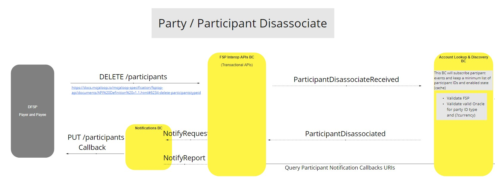

> Account Lookup & Discovery BC - Party/Participant Disassociate

#### Get Participant

Get participant information based on the ID and structure in the documentation [^7].

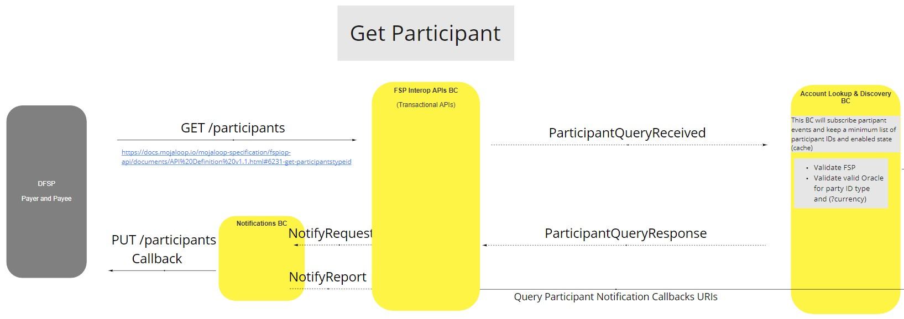

> Account Lookup & Discovery BC - Get Participant

#### Get Party

Get party information based on the ID [^8].

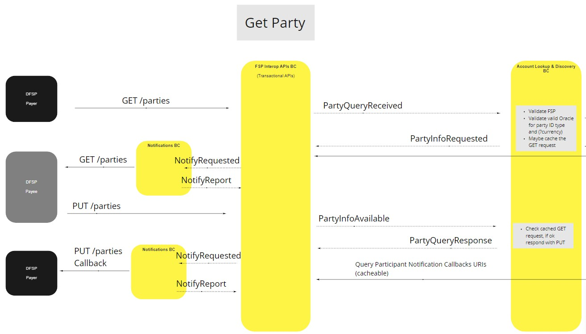

> Account Lookup & Discovery BC - Get Party

### Agreement (Quoting) BC

#### Calculate Quote - Happy Path

When a quote is sent using the defined standards [^3], the FSP IOP API will send the request to the relevant background services and then notify the Payee DFSP with the post quote, it will then respond with a PUT Quotes and updated relevant information. The Payer fsp will then receive the PUT and consider the quote successful.

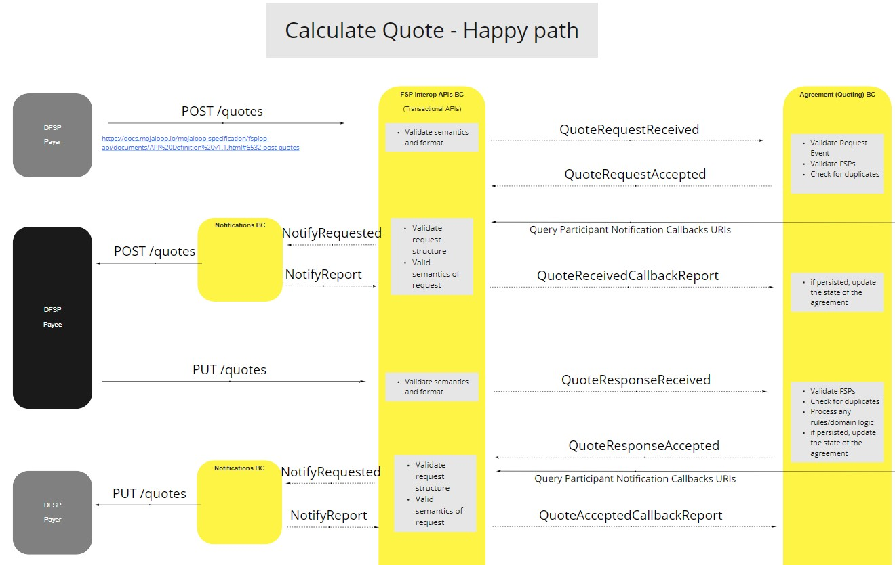

> Agreement BC - Calculate Quote - Happy Path

#### Get Quote - Happy Path

This allows a FSP to get quote information of an existing quote [^4]
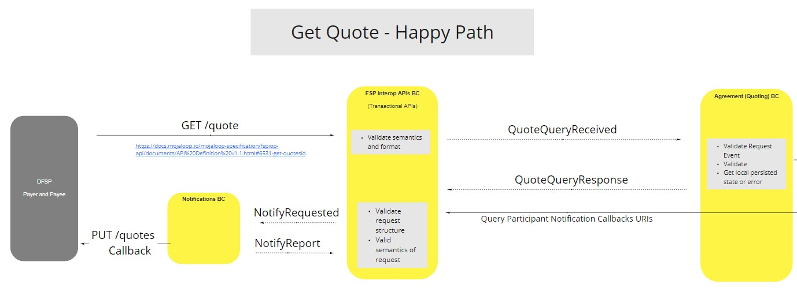

> Agreement BC - Calculate Quote - Happy Pa th

#### Calculate Quote - Invalid Quote Request

When a quote is sent and the defined standards [^3] are not applied and the quote is deemed invalid.

> Agreement BC - Calculate Quote - Invalid Quote Request

#### Calculate Quote - Invalid FSPs

When a quote is sent but the FSP information is not valid and the quote should be discarded.

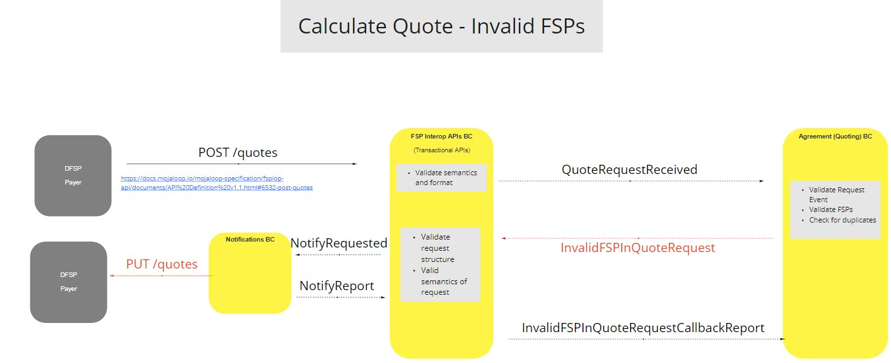

> Agreement BC - Calculate Quote - Invalid FSPs

#### Calculate Quote - Invalid Scheme Rules detected in Request

When a quote is sent but the request does not adhere to the scheme rules set forth for a request.

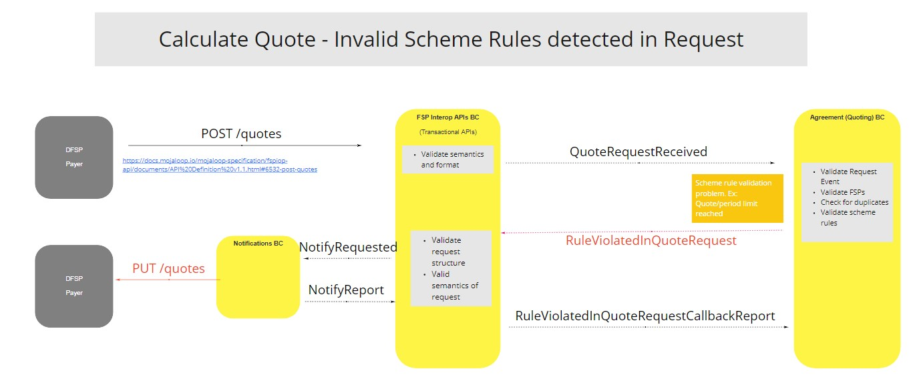

> Agreement BC - Calculate Quote - Invalid Scheme Rules detected in Request

#### Calculate Quote - Invalid Scheme Rules detected in Response

When a quote has been responded to but the response does not adhere to the scheme rules set forth for a response.

> Agreement BC - Calculate Quote - Invalid Scheme Rules detected in Response

### Transfers BC

#### Perform Transfer (Universal Mode)

Transfer without any actor intervention based on the POST transfers request [^9].

> Transfers BC - Perform Transfer (Universal Mode)

#### Perform Transfer with Payee Confirmation

Transfer that relies on the payee to confirm the transfer [^10].

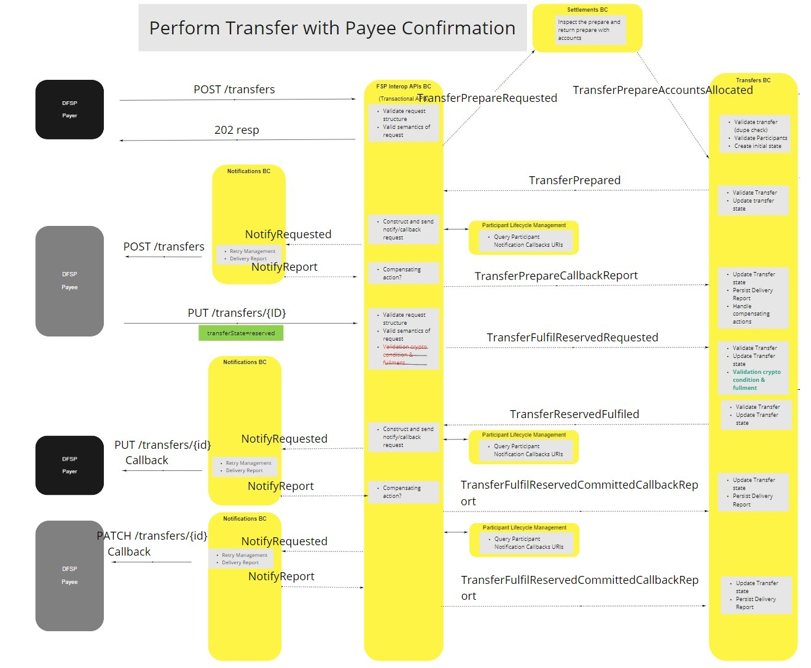

> Transfers BC - Perform Transfer with Payee Confirmation

#### Perform Transfer with Payee Confirmation

Transfer that relies on the payee to confirm the transfer [^10].

> Transfers BC - Perform Transfer with Payee Confirmation

#### Query Get Transfer

Gets the transfer info based on the transfer ID used in GET request [^11].

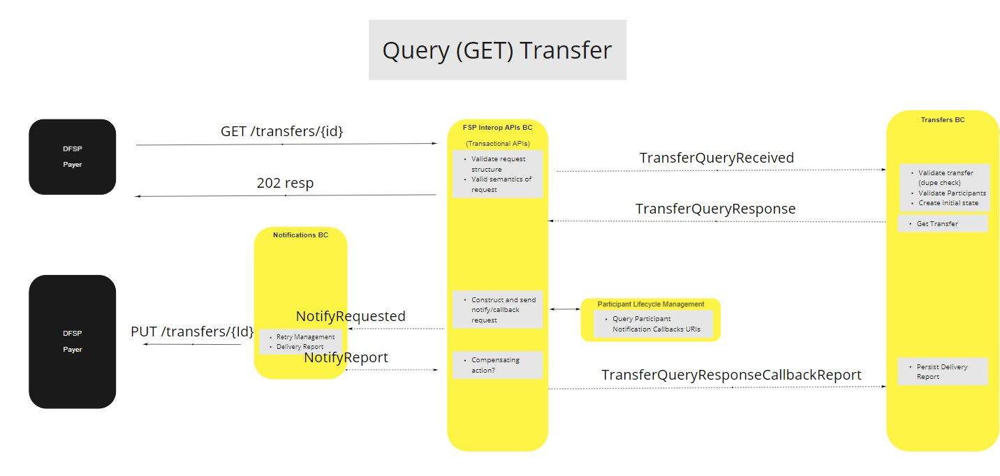

> Transfers BC - Query Get Transfer

#### Perform Transfer - Duplicate Post (Resend)

Transfer [^9] has already been process and a status report is returned to the Payer DFSP (Sender).

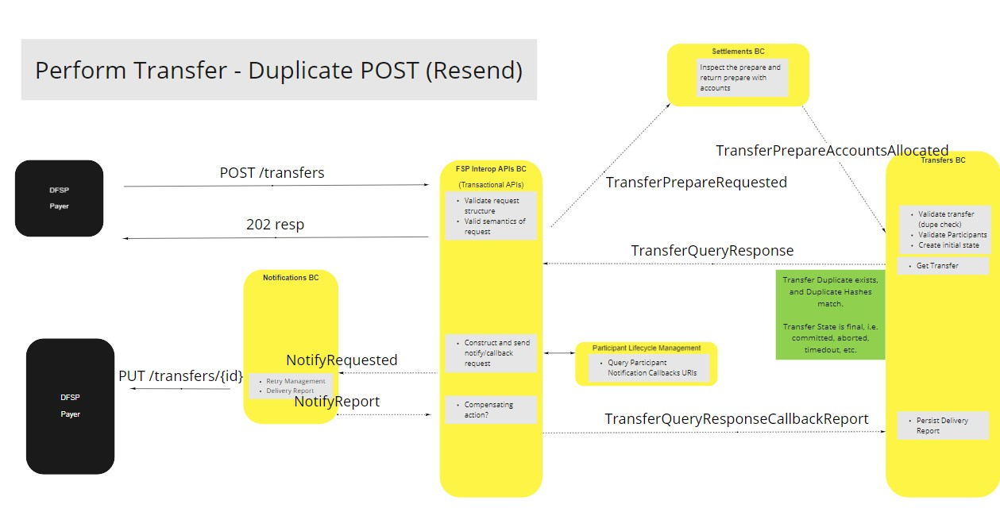

> Transfers BC - Perform Transfer - Duplicate Post (Resend)

#### Perform Transfer - Duplicate Post (Ignore)

Transfer [^9] has already been process but no response is needed or requested.

> Transfers BC - Perform Transfer - Duplicate Post (Ignore)

#### Perform Transfer - Payee DFSP Rejects Transfer

Transfer gets rejected by the Payee DFSP [^12] and thus returns an error to Payer DFSP.

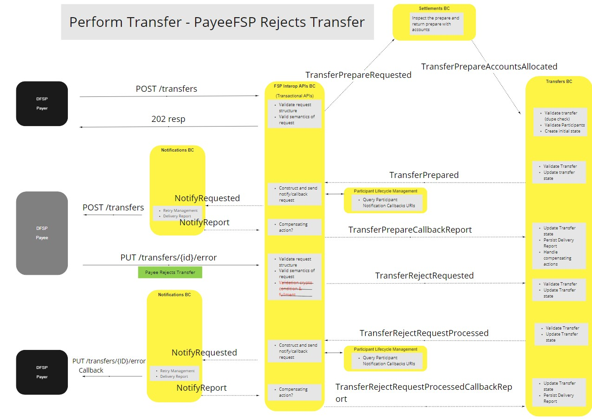

> Transfers BC - Perform Transfer - Payee DFSP Rejects Transfer

#### Perform Transfer - Timeout (Prepare)

Transfer gets rejected because the transfer timed out [^13] while funds are being prepared.

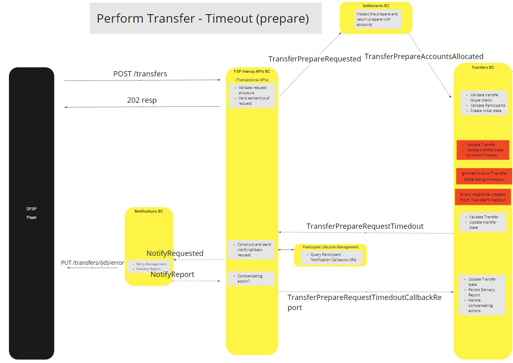

> Transfers BC - Perform Transfer - Timeout (Prepare)

#### Perform Transfer - Timeout (Pre-Committed)

Transfer gets rejected because the transfer timed out [^13] before funds are committed.

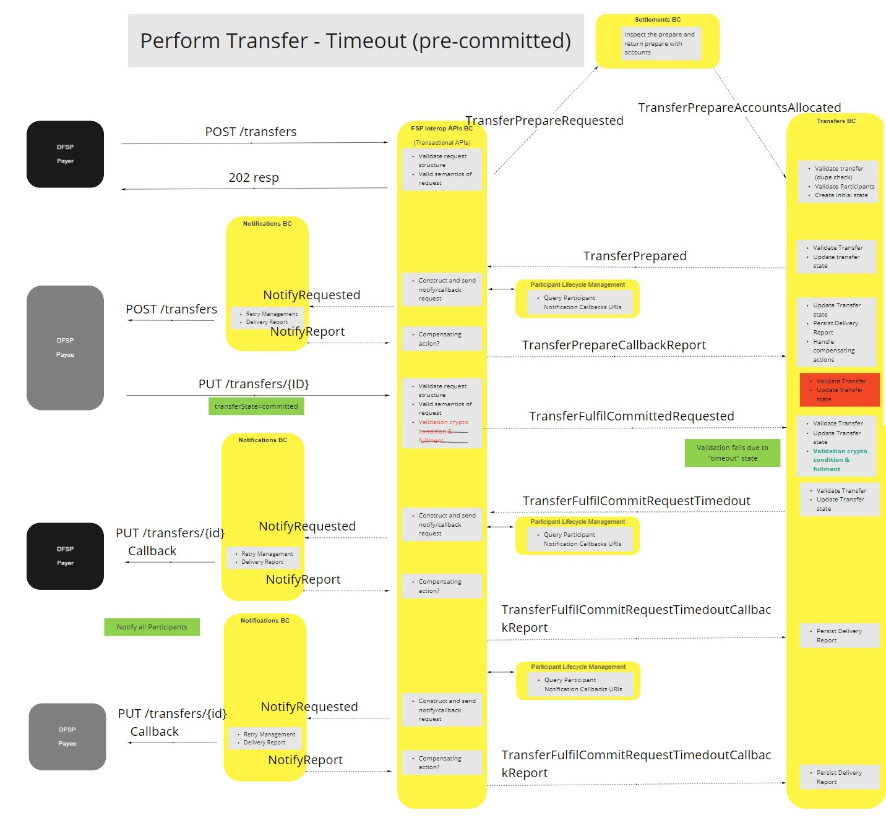

> Transfers BC - Perform Transfer - Timeout (Pre-Committed)

#### Perform Transfer - Timeout (Post-Committed)

Transfer gets rejected because the transfer timed out [^13] after funds were committed.

> Transfers BC - Perform Transfer - Timeout (Post-Committed)

#### Perform Transfer - Duplicate Post (None Matching)

Transfer gets rejected because the transfer is flagged as a non matching duplicate .

> Transfers BC - Perform Transfer - Duplicate Post (None Matching)

#### Perform Transfer - Payer FSP Insufficient Liquidity

Transfer gets rejected because the transfer is flagged as a non matching duplicate .

> Transfers BC - Perform Transfer - Payer FSP Insufficient Liquidity

#### Perform Transfer - Transfer Prepare Rejected

Transfer gets rejected by the Payee DFSP while the transfer is in the preparation stage.

> Transfers BC - Perform Transfer - Transfer Prepare Rejected

#### Perform Transfer - Transfer Prepare Validation Failure (Invalid Payer Participant)

Transfer gets rejected because the Payer DFSP is invalid for that transaction.

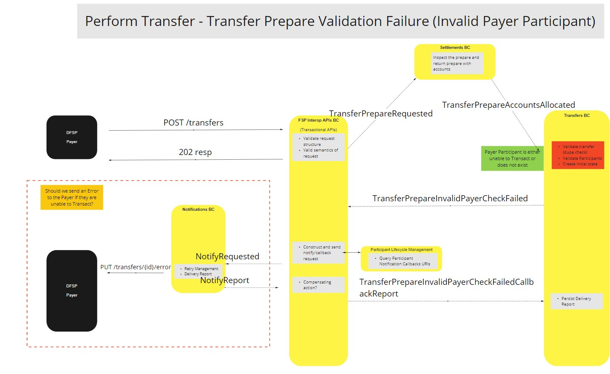

> Transfers BC - Perform Transfer - Transfer Prepare Validation Failure (Invalid Payer Participant)

#### Perform Transfer - Transfer Prepare Validation Failure (Invalid Payee Participant)

Transfer gets rejected because the Payee DFSP is invalid for that transaction.

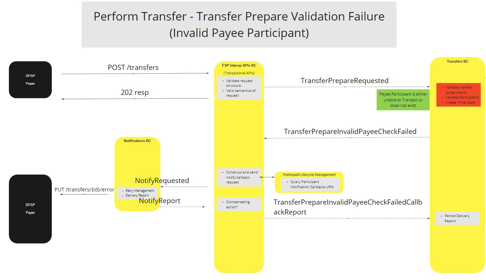

> Transfers BC - Perform Transfer - Transfer Prepare Validation Failure (Invalid Payer Participant)

<!-- Footnotes themselves at the bottom. -->

## Notes

[^1]: [Mojaloop Common Interface List](../../commonInterfaces.md)
[^2]: [Open API for FSP Interoperability Specification Documentation](https://docs.mojaloop.io/mojaloop-specification/)
[^3]: [Post Quote - Definition](https://docs.mojaloop.io/mojaloop-specification/fspiop-api/documents/API%20Definition%20v1.1.html#6532-post-quotes)
[^4]: [Get Quote - Definition](https://docs.mojaloop.io/mojaloop-specification/fspiop-api/documents/API%20Definition%20v1.1.html#6531-get-quotesid)
[^5]: [Post Participant - Definition](https://docs.mojaloop.io/mojaloop-specification/fspiop-api/documents/API%20Definition%20v1.1.html#6233-post-participantstypeid)
[^6]: [Delete Participant - Definition](https://docs.mojaloop.io/mojaloop-specification/fspiop-api/documents/API%20Definition%20v1.1.html#6234-delete-participantstypeid)
[^7]: [Get Participant - Definition](https://docs.mojaloop.io/mojaloop-specification/fspiop-api/documents/API%20Definition%20v1.1.html#6234-delete-participantstypeid)
[^8]: [Get Parties - Definition](https://docs.mojaloop.io/mojaloop-specification/fspiop-api/documents/API%20Definition%20v1.1.html#6331-get-partiestypeid)
[^9]: [Post Transfers - Definition](https://docs.mojaloop.io/mojaloop-specification/fspiop-api/documents/API%20Definition%20v1.1.html#6732-post-transfers)
[^10]: [Commit Notification - Definition](https://docs.mojaloop.io/mojaloop-specification/fspiop-api/documents/API%20Definition%20v1.1.html#6726-commit-notification)
[^11]: [Get Transfer - Definition](https://docs.mojaloop.io/mojaloop-specification/fspiop-api/documents/API%20Definition%20v1.1.html#6731-get-transfersid)
[^12]: [Transaction Irrevocability - Definition](https://docs.mojaloop.io/mojaloop-specification/fspiop-api/documents/API%20Definition%20v1.1.#6722-transaction-irrevocability)
[^13]: [Transfers Timeout and Expiry - Definition](https://docs.mojaloop.io/mojaloop-specification/fspiop-api/documents/API%20Definition%20v1.1.html#6724-timeout-and-expiry)
