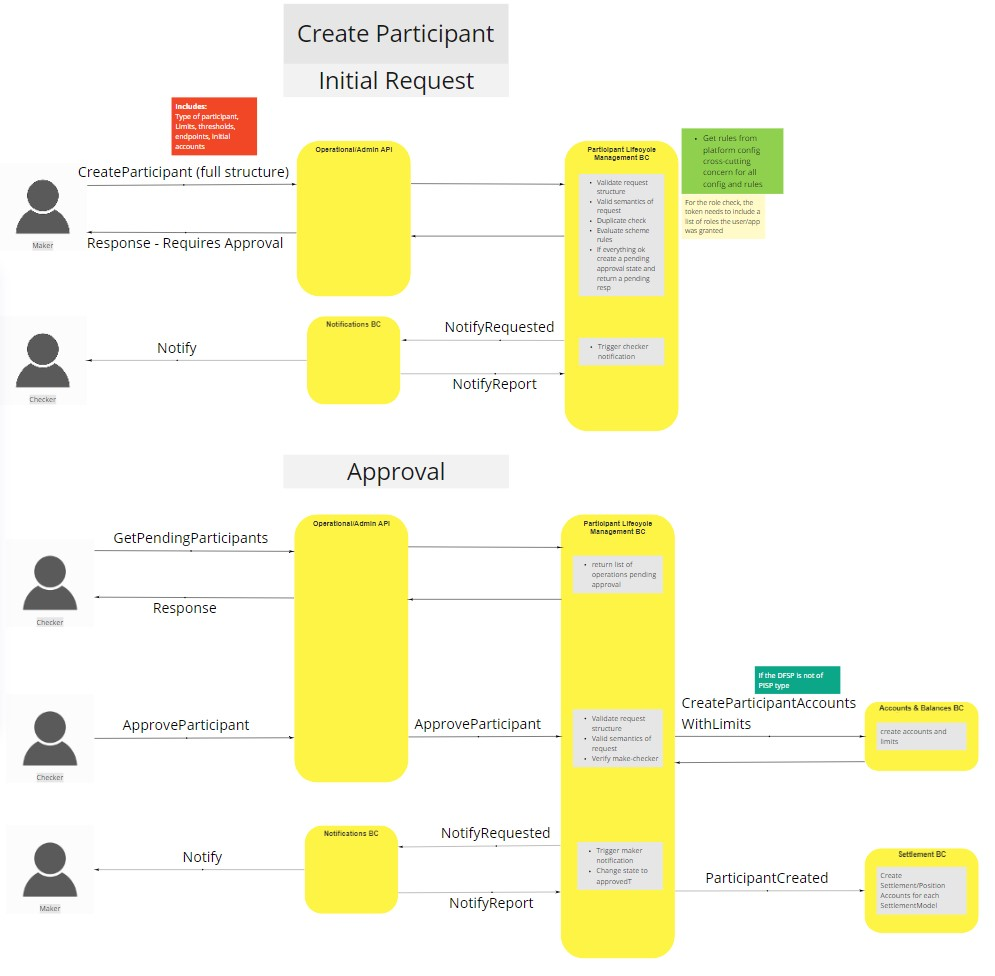
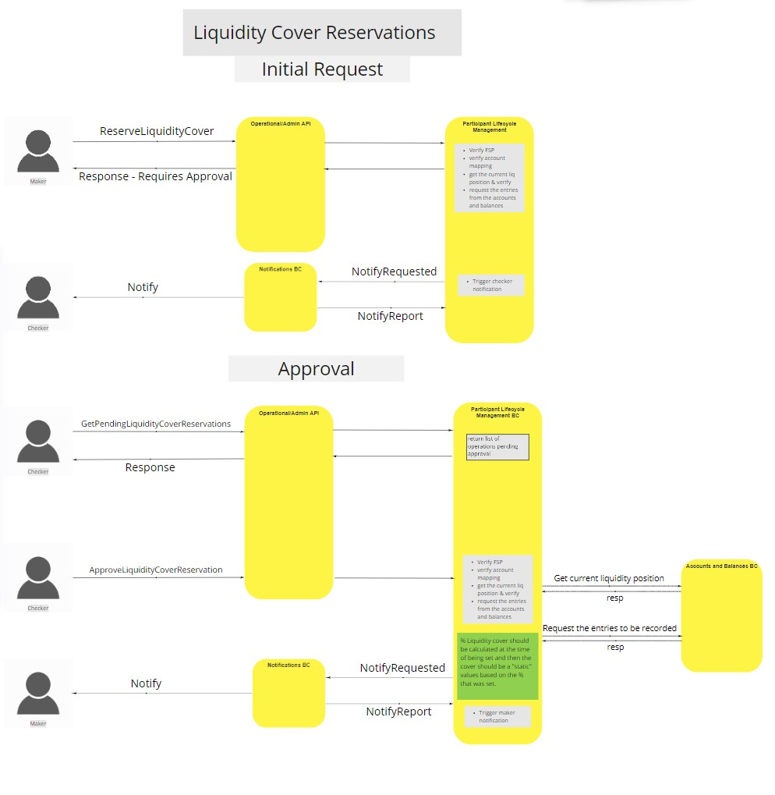
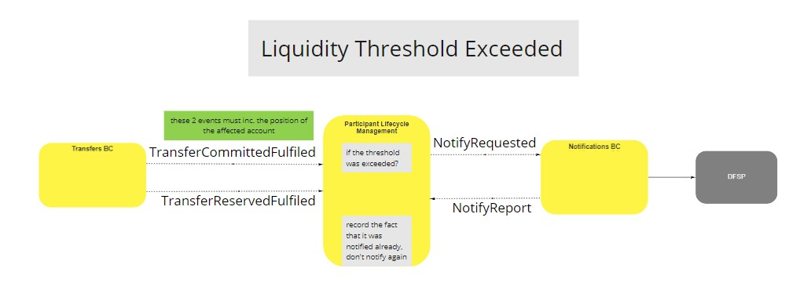

# Participant Lifecycle BC

The Participant Lifecycle Bounded Context's primary concern regards anything to do with the management of a Participant within the Mojaloop Environment. 
TODO:
 Maker-Checker Process. [^1]
 Configuration & Bootstrapping
 Operations & Admin API
 Participant endpoints
 Participants can only have one account per allowed currency

## Terms

Terms with specific and commonly accepted meaning within the Bounded Context in which they are used.

| Term | Description |
|---|---|
| Term1 | Description1 |

## Use Cases

### Create Participant (Single Step Registration)

> Create Participant (Single Step Registration)

### Manage Funds

> Manage Funds

### Update Endpoints

> Update Endpoints

### Update Participant Status

> Update Participant Status

### Get Participant

> Get Participant

### Participant Accounts

**Add Participant Account**
**Update Participant Account Status (Enable/Disable)**
**Update Liquidity Limits and Warning Thresholds**

> Participant Accounts

### Reserve Liquidity Cover

> Reserve Liquidity Cover

### Liquidity Threshold Exceeded

> Liquidity Threshold Exceeded

### Liquidity Cover Queries

> Liquidity Cover Queries

<!-- Footnotes themselves at the bottom. -->
## Notes

[^1]: Common Interfaces: [Mojaloop Common Interface List](../../commonInterfaces.md)
