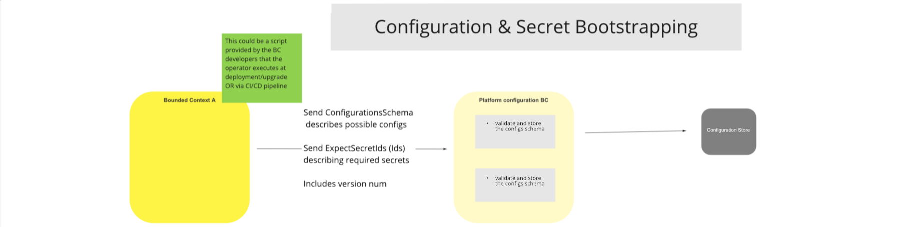

# Platform Configuration And Secret Management BC

The purpose of this Bounded Context is to provide a stable and secure platform from which to manage the configuration and Secret Management of all of the Switch platform Bounded Contexts. The reason for this is approach is to simplify Configuration and Secret Management and increase efficiency.

## Terms

Terms with specific and commonly accepted meaning within the Bounded Context in which they are used.

| Term | Description |
|---|---|
| Secret | Private Key used to validate incoming traffic to a BC.  Ensures that only Actors with matching keys can connect to the BC.
| Crypto BC | Cryptographic BC.  Uses cyphers to encapsulate Secret Management traffic between BCs |
>

## Use Cases

### Configuration & Secret Bootstrapping

#### Description

The purpose of this workflow is to enable authorised SysAdmins and Technical Personnel to centrally manage BC Configurations and Secret bootstrapping. Bootstrapping refers to the startup process entailing loading software and drivers on a host server.  Configurations are versioned and stored in the Switch Configuraton Store.

#### Flow Diagram

> <!--Configuration & Secret Bootstrapping-->

### Configuration Change

#### Description

The purpose of this workflow is to enable authorised SysAdmins and Technical Personnel to upload BC Configuration and Secret changes to the Platform Configuation BC, for versioning and deployment to the relevant BCs, where they are stored locally to minimise system configuration change and bootstrapping delays.

#### Flow Diagram

>

### Secret Provisioning on Target System

#### Description

The purpose of this workflow is to enable authorised SysAdmins and Technical Personnel to create a Secret on a Target BC System and create a corresponding secret in the Switch's Secret Store.

#### Flow Diagram

>

### Secret Provisioning Via Crypto BC

#### Description

The purpose of this workflow is to enable authorised SysAdmins and Technical Personnel to provision a Secret for a specific Target BC System via the Crypto BC, which is stored in the Switch's Secret Store. Once provisioned, they (authorized SysAdmins and Technical Personel) can configure the Secret on the Target BC System.

#### Flow Diagram

>

### Bounded context startup - option 1

#### Description

The purpose of this workflow is to provide a high-level view of an optional BC startup process.

In the instance featured in the flow diagram below, the BC does not make use of local storage, or makes use of non-persisted cache for its Configuration and Secret Management provisioning. As with all BC instances making use of the Platform Configuration BC for configuration storage and provisioning, all configurations are versioned. Version numbers are used in all event and auditing reports and logs to allow for easy identification of the Configuration or Secret version being used during the startup process.

#### Flow Diagram

>

<!-- Footnotes themselves at the bottom. -->
## Notes

[^1]: Common Interfaces: [Mojaloop Common Interface List](../../commonInterfaces.md)
