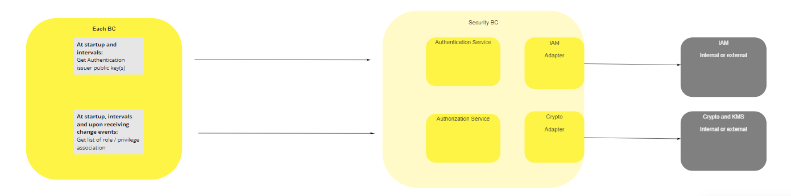
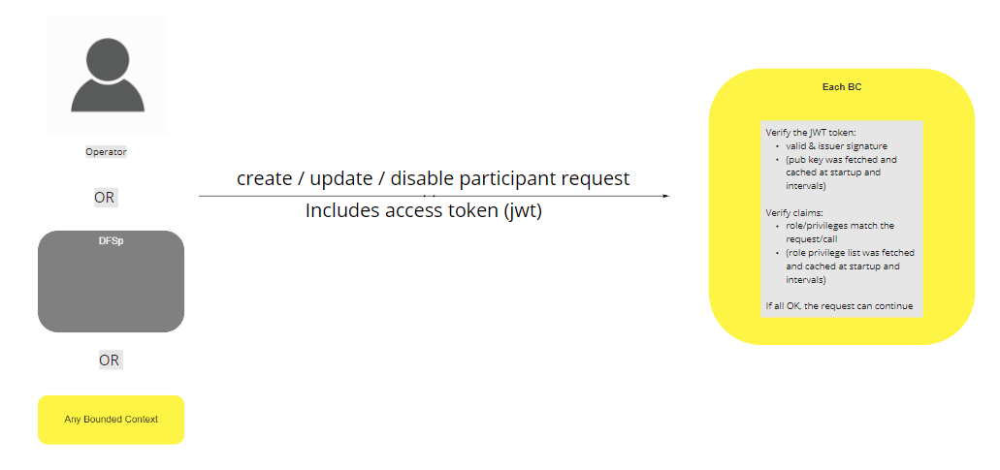

# Security BC

1. Overview
2. User / Operator login (AuthN)
3. Authorization Model (AuthZ)
4. BC bootstrap 
5. BC startup
6. Role / Privilege association
7. Example Query / call

## Terms

Terms with specific and commonly accepted meaning within the Security Bounded Context.

| Crypto providers | Adapter that will provide cryptographic services and Key Management System |
|---|---|
| IAM | Identity and Access Management. Adapter that will provide services for menus, profiles, roles and permissions.  |

## Overview

The protocol is request and response based, and the used transport protocol is secure Hypertext Transfer Protocol Secure (HTTPS). All services use the HTTP POST and GET methods. Both the request and response bodies are encoded in JSON-formatted text.

## Use Cases

### User / Operator login (AuthN)

The login function requires that the user id and a secret key be passed in the http body. The response contains a signed JWT token. The signature is generated by the Crypto subsystem. The login is performed by the Authorization services or IAM.

### Authorization Model (AuthZ)

IAM will provide users / groups, roles and privileges associations. Each BC will also have a list of related roles. When a function or microservice
is called, the role provided in the JWT will be compared with the roles associated with the BC, after signature verfication. 

### BC Bootstrap 

At bootstrap, BC will send list of possible privileges. This is done once per deployement of a new version.

### BC Startup 

At startup the BC will request authentication issuer public keys from Security BC Crypto / KMS subsystems and the list of roles / privileges Security BC IAM subsystem. A local crypto library signature verification function will verfiy the JWT signature and the roles in the JWT will be compared with the local list of roles obtained from the central authorization service. 

### Role / Privilege association 

Roles are associated with a number of privileges.

### Example Query / call 

Client Authorization should be performed by using an access token. A client first needs to request the Authorization Service to create an access token for the user who requests to access the interface. The user is authenticated in the Authorization Service. The created access token is then used for authorization in the interface. 
To use the access token, the client must set the Authorization HTTP header to Bearer [access_token] in each request to the interface.

        

<!-- Footnotes themselves at the bottom. -->
## Notes

[^1]: Common Interfaces: [Mojaloop Common Interface List](../../commonInterfaces.md)
