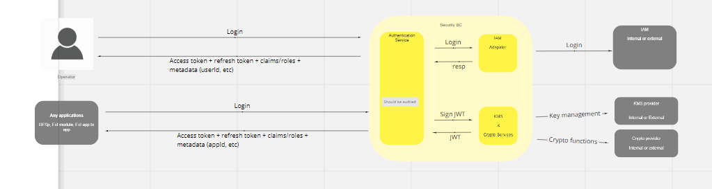

# Security BC

The security BC will handle all request with regard to the following:

1. Authentication
2. Authorization
3. User management (menus, profiles, roles and permissions ) i.e. AIM
4. SSL termination.
5. PIN translation.
6. Application management.
7. Link incryption.
8. PKI (pem)
9. Basic authentication (client id, secret)
10. JWT
11. generique crypto
12. Audit
13. Logging

## Terms

Terms with specific and commonly accepted meaning within the Bounded Context in which they are used.

| Crypto providers | Adapter that will provide cryptographic services and Key Management System |
|---|---|
| IAM | Identity and Access Management. Adapter that will provide services for menus, profiles, roles and permissions.  |
|---|---|
| FIDO | Fast Identification Online. Athentication and Authorization including second factor authentication. Used for Relying Paties clients |
|---|---|
| Audit | Signed log entries. Immutable DB  |

## Overview

## Use Cases

### Signature verification

Eliptic Curve Cryptography Signature Verification.

<!-- Footnotes themselves at the bottom. -->
## Notes

[^1]: Common Interfaces: [Mojaloop Common Interface List](../../commonInterfaces.md)
