# Third Party API BC

The Third Party API BC has been implemented with the Mojaloop 2.0 Reference Architecture to enable third-party PISP Operators (typically applications) to interact with the platform.  Please note that unless otherwise stipulated, all BC references pertain to the various Mojaloop components or Bounded Contexts (BCs).

## Terms

The following common terms are used in this BC:

| Term | Description  |
| ---- | ------------ |
| PISP | Payment Initiation Service Provider (e.g. PayPal, ApplePay, GooglePay, etc.) |
| DFSP | Digital Financial Service Provider (e.g. Bank, Mobile Money Operator) |
| User | DFSP/PISP client (as indicated) |

## Use Cases

**Note:** Our Use Cases cover two specific scenarios:

| Scenarios | Description |
| --------- | ----------- |
| Linking | PISP Housekeeping activities. |
| Transfer | PISP Transfer initiation activities. |

### Linking Scenarios

### PISP Gets supported DFSPs

#### Description

PISP requests a list of DFSPs supported by the system.

#### Flow Diagram

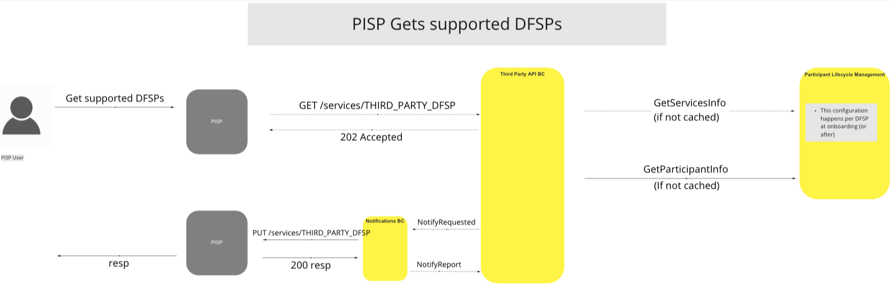
>

### PISP Gets list of accounts for a DFSP + Identifier

#### Description

PISP requests a list of DFSP Accounts and Account Identifiers.

#### Flow Diagram

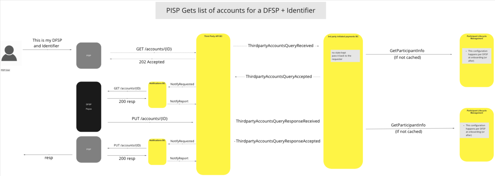
>

### PISP Consent Request

#### Description

PISP requests access consent to specific (scoped) Accounts details.

#### Flow Diagram

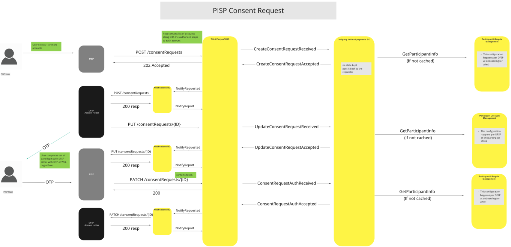
>

### DFSP Issue Consent

#### Description

In order to fulfil the PISP request for consent to access a User's account details, the DFSP issues a Consent Request to the User asking them to indicate consent via their device.

#### Flow Diagram

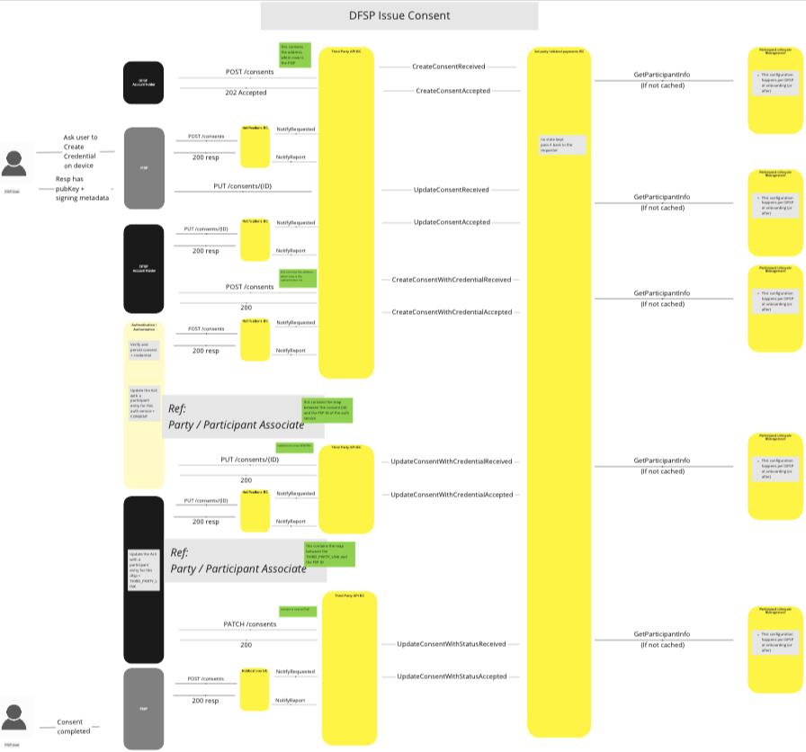
> 

### Unlink Accounts - Hub Hosted Auth

#### Description

A request is made via the DFSP to revoke PISP access consent for a User Account.  Both the DFSP and the User are provided with notification once access consent has been revoked.

#### Flow Diagram

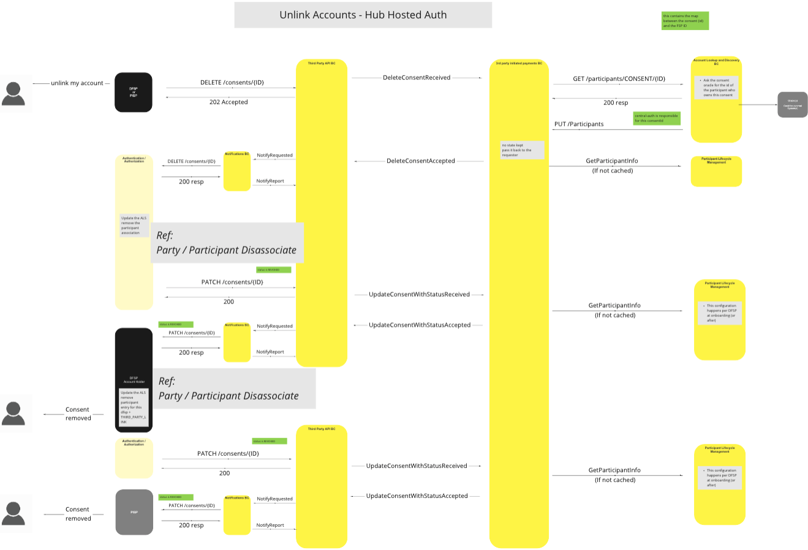
>

### Link Accounts - Account Discovery Failure

#### Description

PISP User issues Account Discovery request containing the incorrect DFSP Identifier.  The User is notified and advised to check and retry.

#### Flow Diagram

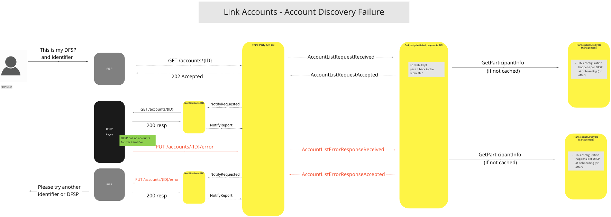
>

### Link Accounts - DFSP Rejects Consent Request

#### Description

PISP User issues request to link to DFSP-held Accounts with an incorrect Account scope which the DFSP rejects, noting the reason for the rejection to the PISP User and suggesting that they check their request and retry.

#### Flow Diagram

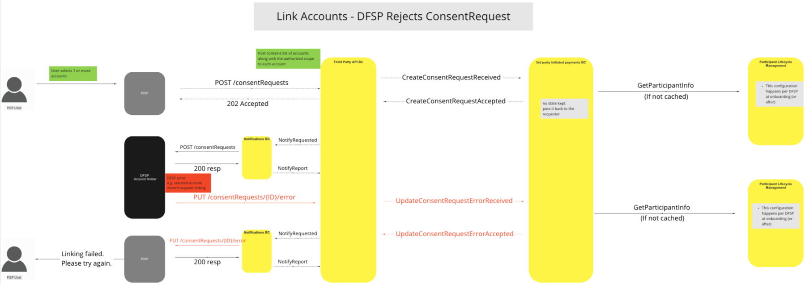
>

### Credential Registration Error

#### Description

PISP requests User to create an authorisation credential consenting to PISP interaction with DFSP held Account scope.  The PISP is notified that the DFSP has rejected the Registration due to invalid data in the signed challege or metadata.  The PISP User is notified.

#### Flow Diagram

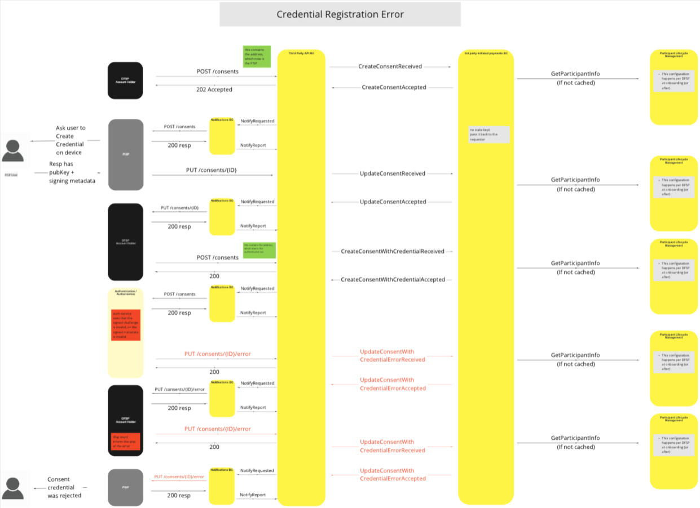
>

### Unlink Accounts - Consent not found

#### Description

The PISP or DFSP receives a request to unlink a PISP User Accounts.  The request is rejected upon inspection as the Account Lookup & Discovery Oracle reports that the Participant that owns the Account does not include the correct Consent ID.  The 3rd Party Initiated Payments BC issues a DeleteConsentFailed rejection message to the PISP/DFSP User.

#### Flow Diagram

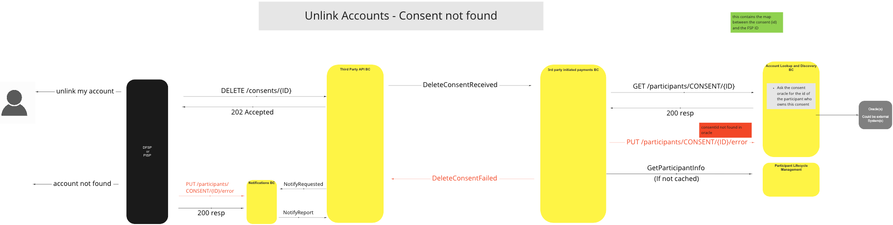
>

### DSPF Rejects OTP/Auth Token from PISP

#### Description

The User selects one or more bank accounts to link via their PISP and uses an out-of-bankdwidth service to complete the linking request using either an OTP, or Web Login flow.  Due to an expired or incorrect token being used, the link request is rejected.

#### Flow Diagram

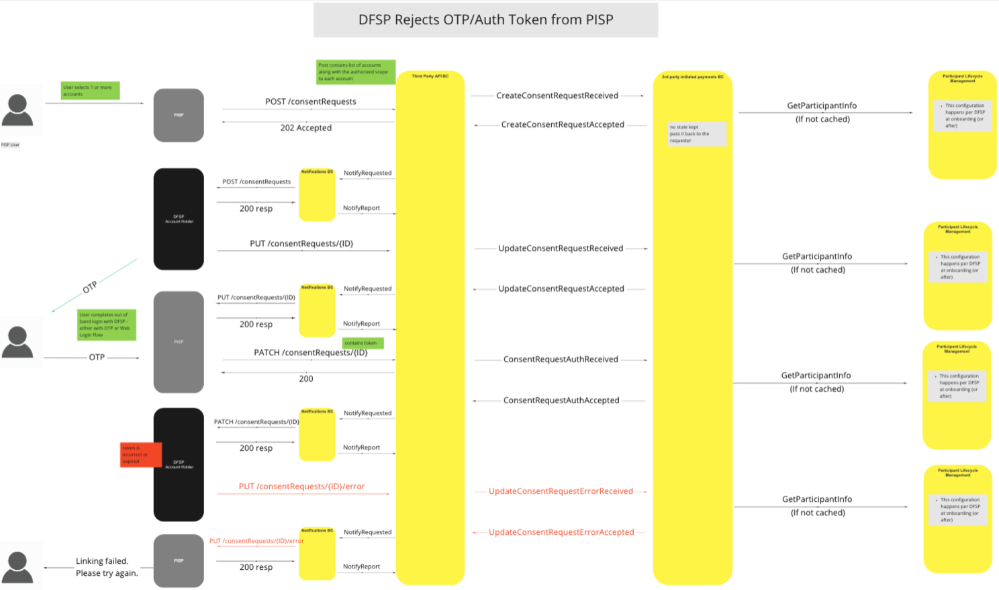
>

### Unlink Accounts - Downstream Failure

#### Description

The PISP/DFSP User receives a confirmation request  to unlink accounts from their profile.  Once the confirmation is sent, the system encounters an error in either the FSPIOP or Authentication step of the transaction, and the request is declined.

#### Flow Diagram

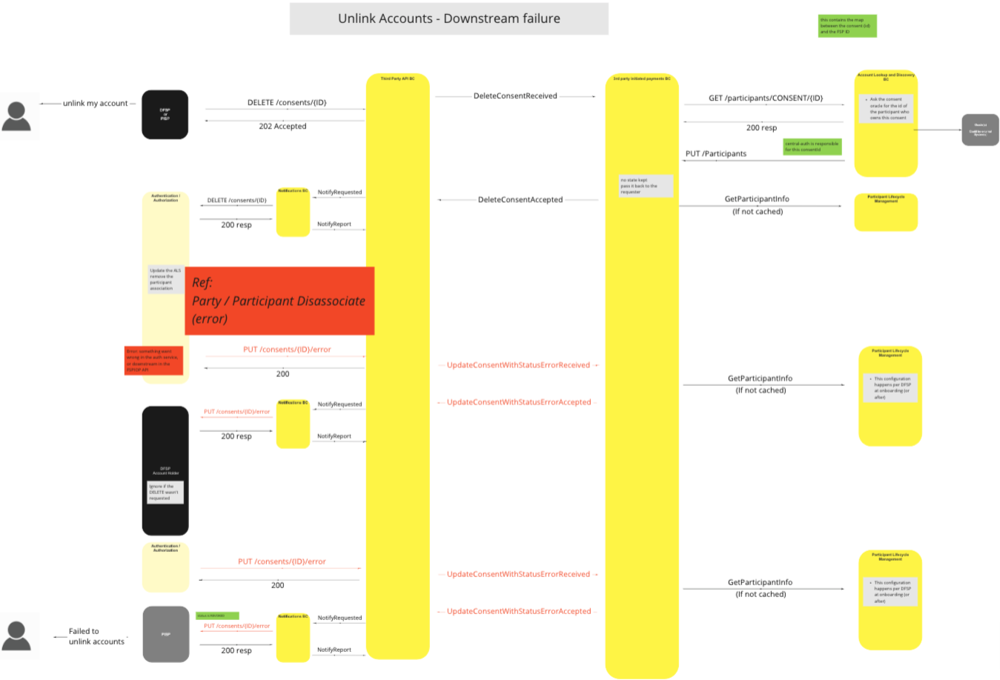
>

### Transfer Scenarios

### Third Party Initiated Transaction Request

#### Description

***Note:*** *In the interests of compacting this workflow description, the reader should note that the Third Party API and the 3rd-Party Initiated Payments BCs work in concert to maintain Participant Information.  The interaction between the two BCs will not be specifically noted, but is as follows: where the Third Party API BC updates the Transaction state, and where the Participant Information is not cached, the 3rd-Party Initiated Payments BC will request the missing Participant Information from the Participant Lifecycle Management BC and deliver it to the Third Party API BC for inclusion in the Transaction information being presented to the DFSP/PISP systems.*

The Third Party Initiated Transaction Request UC provides the workflow for PISP Users/Apps to issue a request to a DFSP to execute a transaction on behalf of an Account Holder, typically the PISP User/App, in favor of a third-party recipient or recipients.  The transaction is vetted via a DFSP confirmation request to the Account Holder, and concluded upon successful receipt of confirmation.  The Switch, per DFSP instructions, manages the transaction and updates all accounts accordingly.

Typical applications would include online and instore environments where a third-party platform such as PayPal is used to execute payments.

#### Flow Diagram

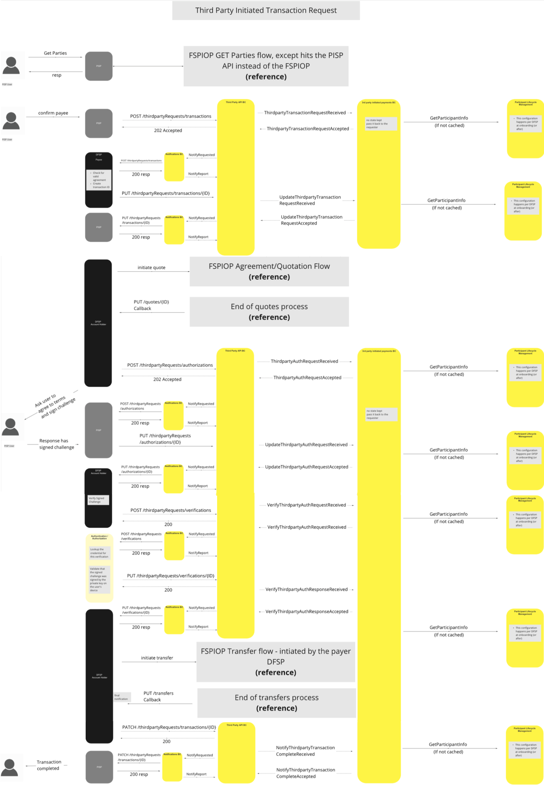
>

### PISP Bulk Transaction Request

#### Description

***Note:*** *In the interests of compacting this workflow description, it is necessary for the reader to under that the 3rd-Party API BC and the 3rd-Party Initiated Payments BC work in concert to maintain the Bulk Transaction Participant Information.  The interaction between the two BCs will not be specifically noted, but will be assumed as follows: where the 3rd-Party API BC updates Participant Information, and where the Participant Information is not cached, the 3rd-Party Initiated Payments BC will request the missing data from the Participant Lifecycle Management BC and deliver it to the 3rd-Party API BC for inclusion in the Transaction information being presented to the DFSP/PISP systems.*

A PISP User initiates a Bulk Transfer request via their PISP application/device. Upon receipt of the Transaction initiation request, the PISP system initiates the Bulk GET Parties workflow FSPIOP API BC. The PISP User is asked to confirm the Participants (Payee), whereafter the PISP system makes use of the 3rd-Party API BC to initiate the Transaction via the 3rd-Party Initiated Payments BC. Where the Participants information has not been cached, the 3rd-Party Initiated Payments BC requests it from the Participant Lifecycle Management BC, and passes it back to the 3rd-Party API BC.

The 3rd-Party API BC sends a notification via the Notifications BC to the DFSP Payee system to check that the transaction request has a valid agreement. If a valid agreement is in place, the DFSP Payee system issues a Transaction ID and returns a transaction update to the Switch via the 3rd-Party API BC. The 3rd-Party API BC updates the Transaction state via the 3rd-Party Initiated Payment BC, and sends a notification to the PISP noting the Transaction state via the Notifications BC.

The DFSP Account Holder initiates a Bulk Agreement/Quote process via the FSPIOP BC, updates the 3rd-Party API BC, and issues a message to the PISP User requesting them to agree to the terms of the Agreement/Quote by signing the message using their device-embedded private key. The PISP system is issued with a notification of the pending agreement via the Notifications BC.  Once the PISP User agrees to the terms of the DFSP Agreement/Quote, the signed agreement is returned to the PISP system which updates the Transaction state via the 3rd-Party API BC and issues an Authorisation Request.

The 3rd-Party API BC issues the Authorisation Request to the DFSP Account Holder via the Notifications BC requesting verification of the signed Challenge.  The DFSP Account Holder acknowledges receipt of the Notification via the Notifications BC, and thereafter updates the Verification using a PUT instruction to the 3rd-Party API BC which updates the Transaction in concert with the 3rd-Party Initiated Payments BC.

Once the Verification Request has been fulfilled, the 3rd-Party API BC sends an Authorisation Accepted notification to the DFSP Account Holder via the Notifications BC.  The DFSP Account Holder initiates a transfer per the Transation, via the FSPIOP BC Bulk Transfer flow.  The FSPIOP BC fulfils and ends the transfer process, and issues a final PUT status update to the DFSP Account Holder. On receipt of the final update, the DFSP Account Holder sends a PATCH update to the 3rd-Party API BC which in triggers it to update the Transaction in concert with the 3rd-Party Initiated Payments BC, and issue a Transaction Completed notification to the PISP User via the Notification BC.

#### Flow Diagram

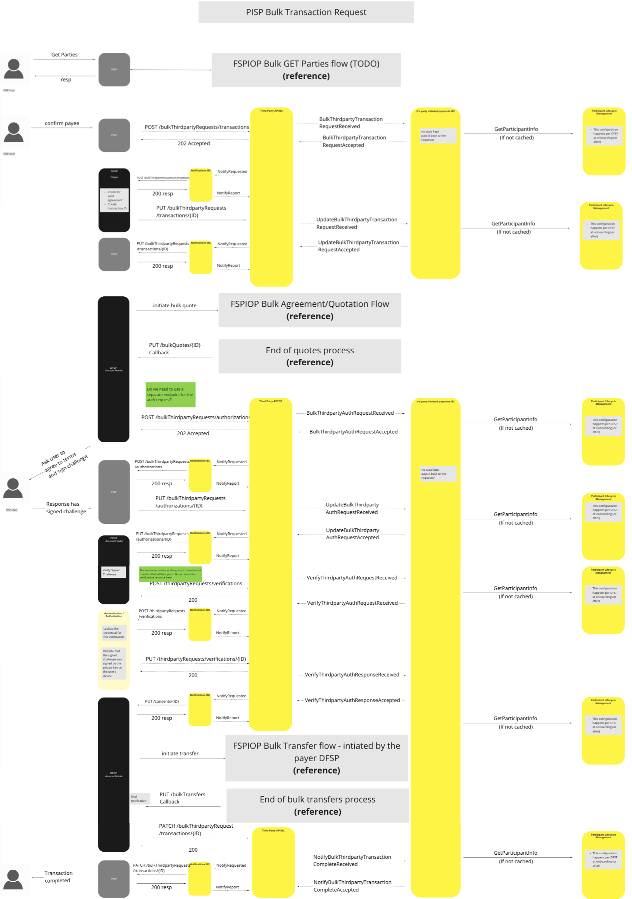
>

The Third Party API BC sends a notification via the Notifications BC to the DFSP Payee system to check that the transaction request has a valid agreement. If a valid agreement is in place, the DFSP Payee system issues a Transaction ID and returns a transaction update to the Switch via the Third Party API BC. The Third Party API BC updates the Transaction state via the 3rd-Party Initiated Payment BC, and sends a notification to the PISP noting the Transaction state via the Notifications BC.

The DFSP Account Holder initiates a Agreement/Quote process via the FSPIOP BC, updates the Third Party API BC, and issues a message to the PISP User requesting them to agree to the terms of the Agreement/Quote by signing the message using their device-embedded private key. The PISP system is issued with a notification of the pending agreement via the Notifications BC.  Once the PISP User agrees to the terms of the DFSP Agreement/Quote, the signed agreement is returned to the PISP system which updates the Transaction state via the Third Party API BC and issues an Authorisation Request.

The Third Party API BC issues the Authorisation Request to the DFSP Account Holder via the Notifications BC requesting verification of the signed Challenge.  The DFSP Account Holder acknowledges receipt of the Notification via the Notifications BC, and runs through the Authentication/Authorization process (lookup transaction verification credential and validate against the private key on the PISP User's device), and thereafter updates the Verification using a PUT instruction to the Third Party API BC which updates the Transaction in concert with the 3rd-Party Initiated Payments BC.

Once the Verification Request has been fulfilled, the Third Party API BC sends an Authorisation Accepted notification to the DFSP Account Holder via the Notifications BC.  The DFSP Account Holder initiates a transfer per the Transation instructions, via the FSPIOP BC Transfer flow.  The FSPIOP BC fulfils and ends the transfer process, and issues a final PUT status update to the DFSP Account Holder. On receipt of the final update, the DFSP Account Holder sends a PATCH update to the Third Party API BC which in turn triggers it to update the Transaction in concert with the 3rd-Party Initiated Payments BC.  Finally, the PISP User is issued with a Transaction Completed notification via the Notification BC.

#### Flow Diagram

>

### Pay to a PISP - PISP as a Payee

#### Description

The DFSP User selects a PISP alias as a Payee.  There are a few steps that are potentially not clear.  They include the following:

 - Instead of being initiated via the PISP, this transaction is initiated via the DFSP.

 - Parties are selected by alias, for example, someone@domainname.tld.

 - DFSP is aware that the Payee is a PISP due to the Payee.partyIdType being "THIRD_PARTY_LINK" and Payee.partyIdValue is a unique identifier issued to the PISP during Account Linking.

 - PayeeDFSP requests a callback from the Switch by setting the transfer status to "RESERVED".

 - Once the transfer has been completed the PayeeDFSP informs the PISP that an account they hold has been credited.

#### Flow Diagram

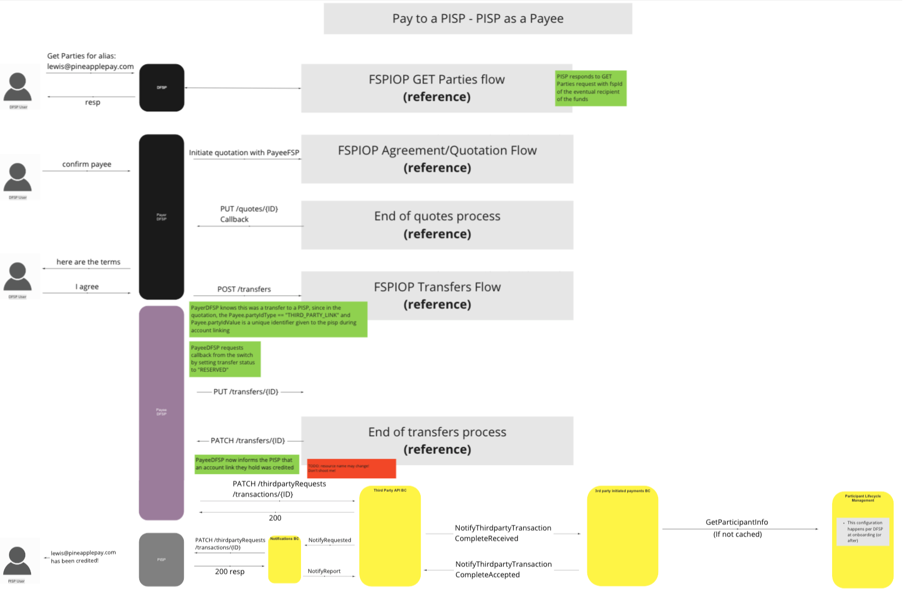
>

### Third Party Transaction Request Failed - Bad Party Lookup

#### Description

A PISP User initiates a Transaction using a bad Party ID, resulting in a lookup failure.

#### Flow Diagram

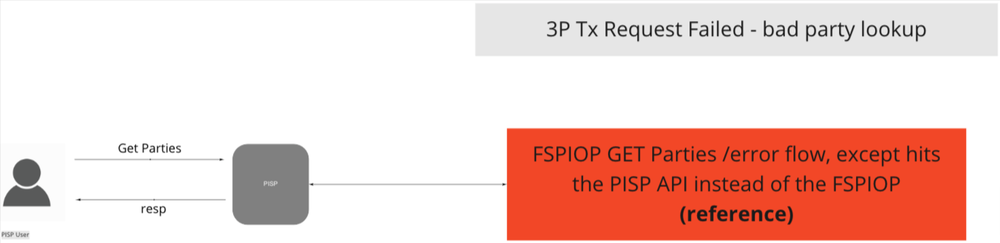
>

### Third Party Transaction Request Failed - Bad Transaction Request

#### Description

A PISP User initiates Third Party Transaction, and correctly confirms the Payee details, however the DSFP fails to find a valid Agreement for the transaction.

#### Flow Diagram

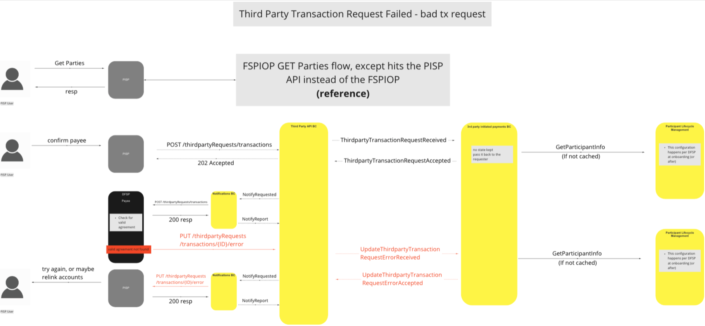
>

### Third Party Transaction Request Failed - downstream FSPIOP failure

#### Description

A PISP User initiates a Third Party Transaction, and confirms the Payee on request from the 3rd-Party API BC via the PISP.  The transaction is then forwarded to the DFSP for confirmation and to create a Transaction ID.  The DFSP successfully triggers the Agreement/Quotation Flow, however it fails for some reason.  The transaction is terminated and the PISP User notified via the 3rd-Party API BC via the Notifications BC.

#### Flow Diagram

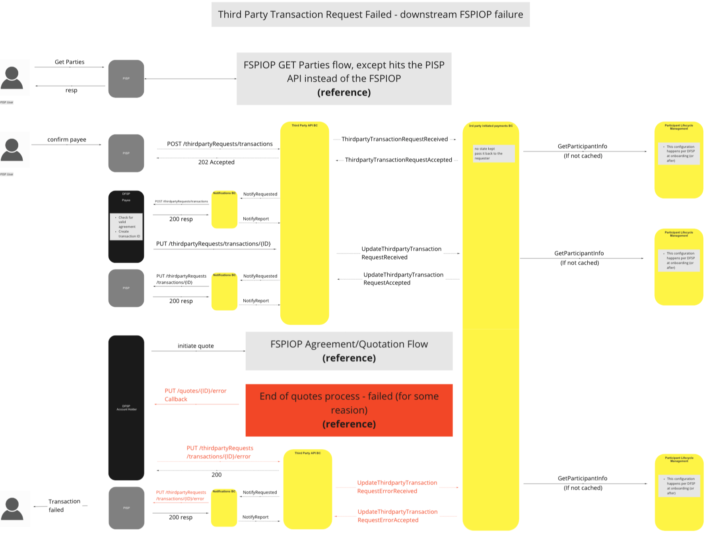
>

### Third Party Transaction Request Failed - authorization was invalid

#### Description

***Note:*** *The flow for this transaction journey follows that of the Third-Party Initiated Transaction Request.  The difference in the flow for this transaction journey occurs during the Authentication/Authorization process, where it fails due to an invalidly signed Challenge. (For a complete description of the transaction journey, please view the [Third Party Initiated Transaction Request journey](#third-party-initiated-transaction-request)*

The transaction journey is failed by the DFSP Account Holder due to the transaction containing an invalidly signed Challenge.  The DFSP Account Holder notifies the 3rd-Party API BC of the error condition via the Notifications BC.  The error is noted and the Participant Account updated via the 3rd-Party API BC working in concert with the 3rd-Party Initiated Payments BC, and the PISP User is notified via the Notifications BC that the transaction failed.

#### Flow Diagram

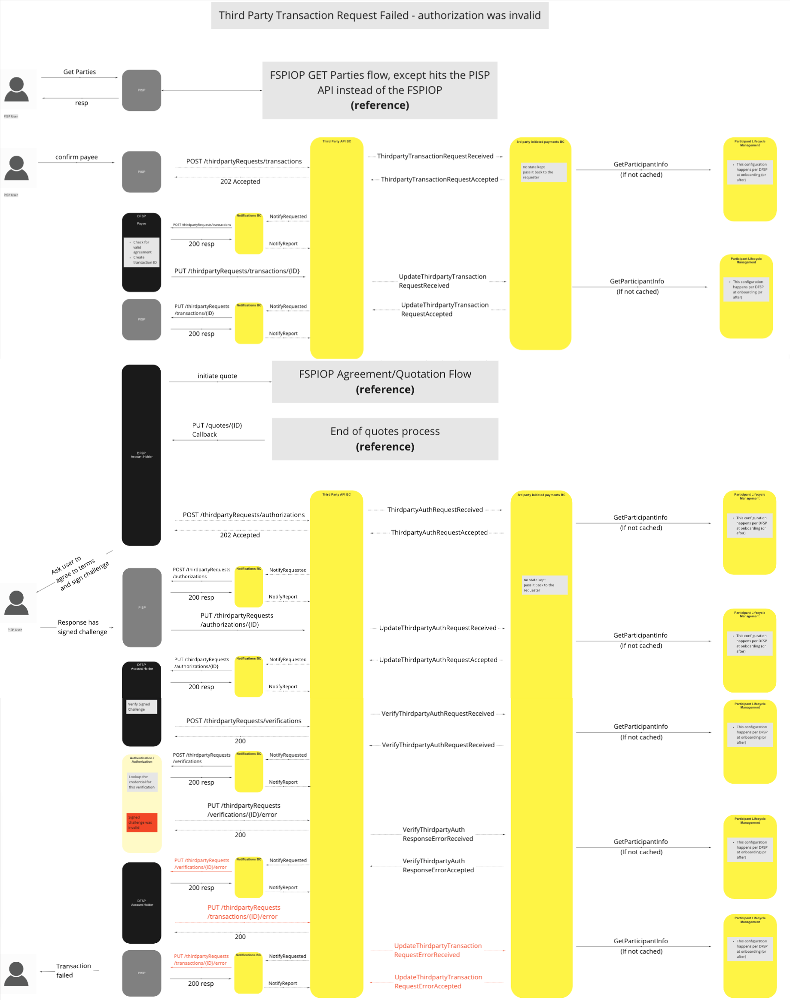
>

### Third Party Transaction Request Rejected by user

#### Description

***Note:*** *The flow for this transaction journey is very similar to the Third-Party Initiated Transaction Request up until the point at which the DFSP Account Holder issues a challenge to the PISP User requesting them to agree to the terms of the transaction return the signed challenge. At this point the PISP User indicates that they wish to cancel the transaction.*

The PISP system receives the challenge response from the PISP User's device indicated that the respond is REJECTED.  The PISP system updates the transaction status via the 3rd-Party API BC noting that it has been REJECTED.  This triggers the 3rd-party API BC to update the Transaction status and issue a notification to the DFSP Account Holder via the Notifications BC that the Transaction has been rejected by the PISP User.  The DFSP Account Holder acknowledges the notification and updates the 3rd-Party API BC, which in turns updates the Transaction status to Complete.  The 3rd-Party API BC updates the Transaction status to CompleteAccepted, updates the Switch Accounts via the 3rd-Party Initiated Payments BC, and notifies the PISP System via the Notifications BC of the status change.  The PISP System issues a notification acknowledgement via the Notifications BC and the transaction is terminated by the 3rd-Party API BC.

#### Flow Diagram

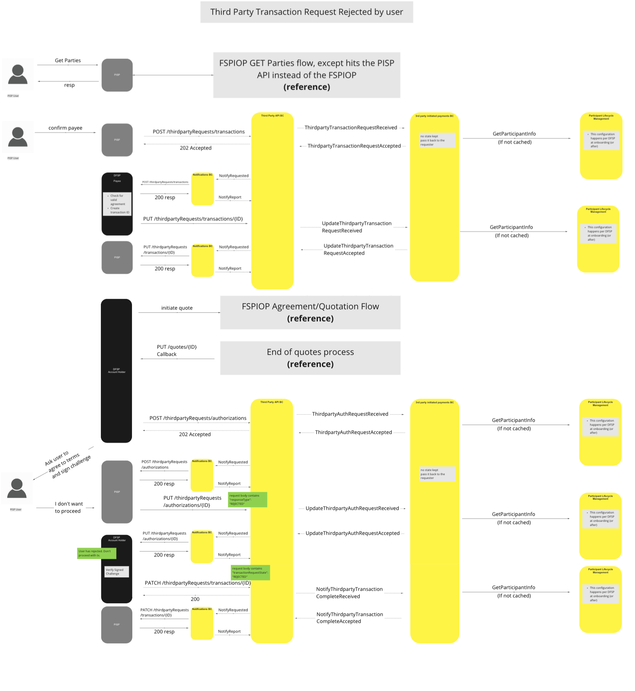
>

### Third Party Transaction Request Failed - DFSP timeout

#### Description

***Note:*** *The flow for this transaction journey follows that of the Third-Party Initiated/PISP Bulk  Transaction Request.  The difference in the flow for this transaction journey occurs during the Agreement/Quote process where the DFSP Account Holder issues a message to the PISP User requesting them agree to the terms of the transaction agreement and sign the challenge token.  Where the PISP User fails to respond to the message within the allowed time a timeout will occur and the DFSP Account Holder cancels the transaction, the DFSP System will cancel the transaction noting a Request Error has occured.*

As per the note above, the DFSP Account Holder updates the 3rd-Party API BC that it has encountered a Transaction error via a Third Party request and provides the Transaction ID, along with the error code.  The participant/s account/s are updated via the 3rd-Party Initiated Payments BC and a notification is sent to the PISP via the Notification BC.  The PISP acknowledges receipt of the notification and notifies the PISP User that Transaction ID has failed.

#### Flow Diagram

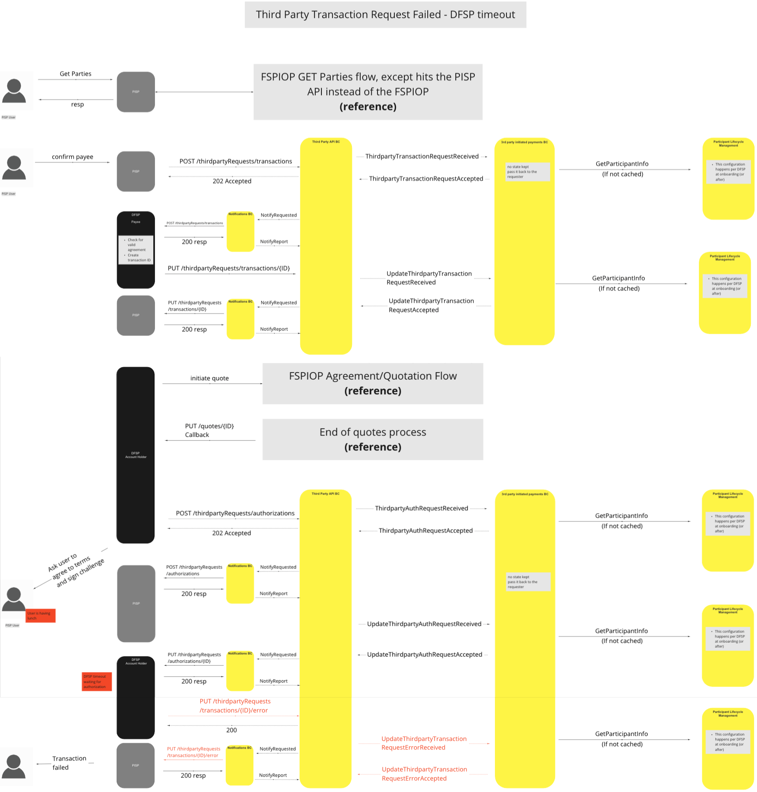
>

<!-- Footnotes themselves at the bottom. -->
## Notes

[^1]: Common Interfaces: [Mojaloop Common Interface List](../../commonInterfaces.md)
