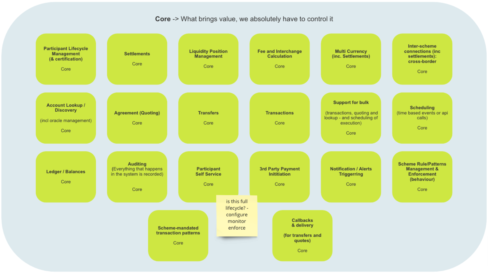
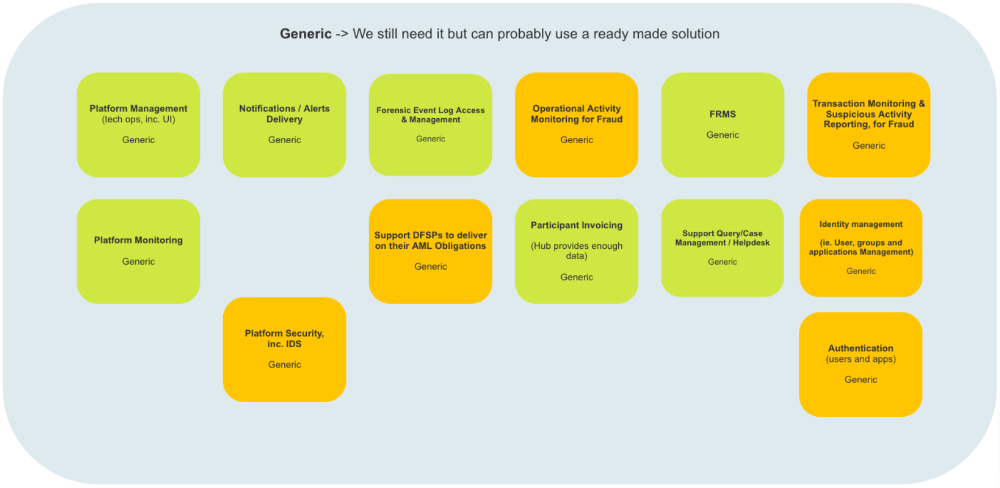
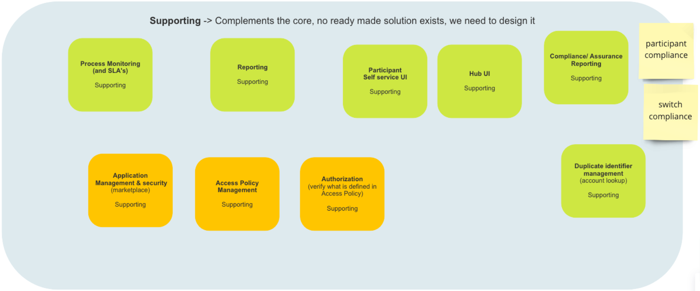
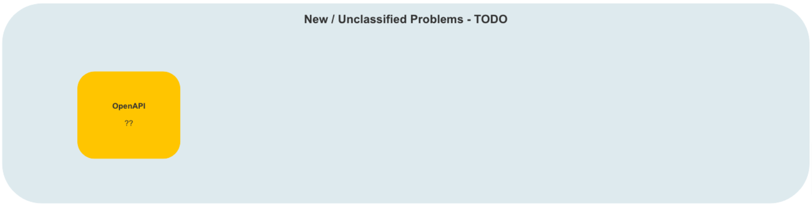
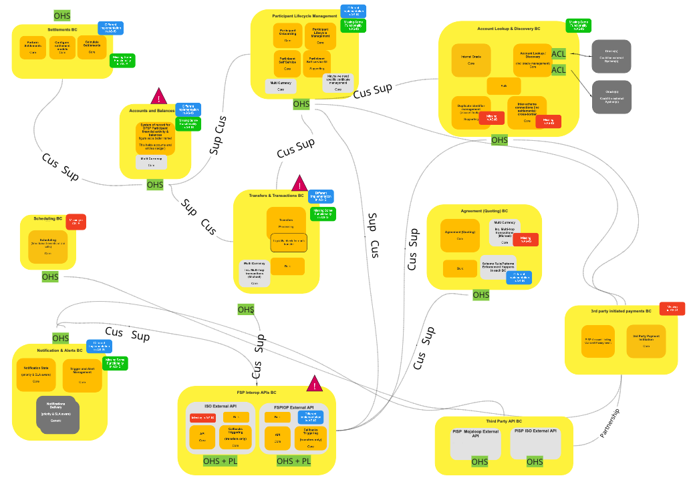

# Reference architecture

## Principles guiding this architecture

The Mojaloop 2.0 Reference Architecture design has been guided by  Domain-Driven Design[^1] principles, and inspired by SOLID[^2] object-oriented programming principles for building software applications.

To provide an understanding of the architecture interpretation by Mojaloop, we include a brief overview of Domain Driven Design architecture.

### DDD-Architecture Overview

The DDD-architecture[^3] implementation for Mojaloop includes the following components -

* **Problem Space** - Typically DDD-architecture recognises business requirements as belonging to separate domains.  For example an eCommerce system is seen as a **_Domain_**.  But an eCommerce system has several components in order to work such as an inventory, a shopping cart, checkout, etc.  Each component is categorised as a **_Subdomain_** that contributes value to the domain which is the eCommerce system.  Mojaloop uses a single domain - it is a switch.

    The Problem Space is one of two containers where all of the identified business problems (improvements/services) that need to be solved are contained.  Depending on the complexity of the Business Problem (improvement), or indeed the scale of problems needing to be solved, it is possible to devolve the initial subdomain structure into additional Subdomains.  Each problem is assigned to its own Subdomain.  Care should be exercised however, to ensure that each Subdomain is absolutely necessary, and focused on delivering value to the domain to avoid an unnecessary and confusing plethora of Subdomains filling the Problem Space.

    Each improvement/service thus contained in a separate Subdomain allows for different teams to develop manageable chunks of the system which is more efficient and less risk-prone than building an entire system in one structure.  A sizable benefit to this approach is that the entire development process can be centered around improving and adding value to the platform, and not just adding features.

    Typically the Problem Space includes three containers which broadly indicate how, or what is going to be used to solve a particular problem, to which a fourth container has been added for Non-Functional Requirements (NFRs) -

  * Core - solutions dependent on internal builds for completion.
  * Supporting - solutions that can be implemented using off the shelf products - for example, secure login.
  * Generic - solutions that can use off the shelf products, but which need additional coding to implement, not just integration - for example, reporting and authentication
  * Non-functional Requirements (NFRs) - solutions that are required to address common needs, but that do not contribute directly to the value of the product

* **Solution Space** - A second major component of DDD-Architecture is the Solution Space.  It differs from the Problem-Space in that its focus is not on what to solve, but how a problem (improvement/service) is going to be solved.  The Solution Space thus necessarily includes more technical information and details for how the problem should be solved. \
The Solution Space introduces a number of elements to aid and align problem solving development efforts

* **_Bounded Contexts_**  In any given project, except perhaps the smallest, there will most likely be multiple solutions to a particular problem, and multiple business processes each with their own subset or dialect of the main business language.  This makes it very difficult to come up with a single solution to all of the problems needing to be solved.  There are often different solutions that can be applied to a problem and each will probably include subsets or dialects of the primary domain language.  So rather than trying to develop a single one-size-fits-all solution, Bounded Contexts were introduced that include solutions, typically one per Bounded Context, and a consistent language subset or dialect.

    Often mapping between Bounded Contexts and subdomains will not be one-to-one.  As Subdomains belong to the Problem Space and Bounded Contexts to the Solution Space, it is quite possible that scenarios will occur where a Subdomain contains more than one Bounded Context, or where a Bounded Context may span multiple Subdomains.  Sometimes, though not always, this may be indicative of a rethink being required regarding the boundaries of either entity.

    Typically, and definitely in the Mojaloop environment, solutions are developed and implemented with an awareness of but no direct integration or dependencies outside of their context.  This approach aids security, amongst other things by ensuring that each Bounded Context is only aware of its own environment.  Communications between Bounded Contexts are all conducted via APIs and secured messaging.  Examples of Bounded Contexts (BCs) from the Mojaloop environment include Accounts & Balances, Transfers & Transactions, etc.

* **_Ubiquitous Language_** Typically a business occupies a domain that includes several subdomains.  This means that whilst there is most likely a main language in use across the domain, there may well be several subsets or dialects of that language in use within the subdomains.  In order to accommodate this and ensure that the business is correctly aligned across its entirety, DDD-architecture introduced Ubiquitous Language as a solution.  This ensures that business and technical teams are speaking the same language regardless of domain/subdomain that they are retained to address.  This serves two main purposes:

  * It ensures that unique terms are identified and understood to have a single meaning by all parties within the Bounded Context.  An example might include the word, “Account”, which could be understood as an Account Profile by one party, and a reference to an Accounting System Account by another.  Creating and declaring a single Ubiquitous Language that includes all of the relevant terms ensures that confusion is limited, if not avoided.
  * The second benefit that Ubiquitous Language provides is limiting the opportunity for, as an example, technical interpretation of language to dominate the Space, and visa versa.  This can prevent dominance by a particular group which may lead to conflict within the group.has been introduced to reduce misunderstandings that often exist between business and developers.  It describes a common language that is introduced to ensure that developer-speak does not dominate conversations where business is involved, and also provides business with the means to articulate business requirements to developers without getting down into the weeds of developers’ language.

  In order to ensure that segregation of Bounded Contexts is maintained, Mojaloop makes use of two additional features - 

  * **_OHS_** or **_Open Host Service_**, a method by which access to a system is provided using clearly defined services in accordance with clearly defined protocols.  This ensures that a system does not need to have knowledge of any other systems within a Domain.  This approach ensures that changes to upstream/downstream systems will not be necessary to support system enhancements or extensions.
  * **_PL_** or **_Published Language_**, is often used in conjunction with OHS in order to ensure that provided a developer builds their product in accordance with the Published Language being used, for example, XML, they will not have to make use of any special libraries or implementations in order to communicate with an upstream system.

  Examples of where OHS/PL are used in conjunction in the Mojaloop environment is the FSP Interop APIs BC which currently includes the FSPIOP External API[^4], and which will also include the ISO External API once it has been developed.

* **_Cross Cutting Concerns_**[^5]  To understand a Cross Cutting Concern, we first need to understand what a Concern is.  A Concern is usually categorised as being part of a system but separated on the basis of functionality.  So for example, a Concern could be an algorithm that needs to be included in a system component to support a legacy requirement that is applicable to a single Bounded Context (or function/module) within a system.

    Cross Cutting Concerns are concerns that are applicable across multiple Bounded Contexts (or functions/modules) and include items such as auditing, security, authentication, and platform (Business and Technical) configuration management.

* **_Mapping:_** A very useful feature that can be included in a Solution Space map are connectors indicating relationships between Subdomains and Bounded Contexts.  This is particularly useful as it enables highlighting of issues or dependencies visually so that teams are aware of them.  They can also be used to manage potential misunderstandings and conflicts between teams. (_The Mojaloop 2.0 Reference Architecture team is not using this approach_)

### SOLID Principles

In addition to DDD-architecture, Mojaloop’s architecture approach has been inspired by SOLID principles -

* Single responsibility and internal interfaces provide the ability to implement additional Domains, such as ISO, without needing to change the core architecture
* Software entities should be extended but never modified.  The rule is never hack core, always extend through add-on modules or nodes
* Functions using references to base classes should be able to use objects of derived classes without being aware of it
* Several client-specific interfaces are better than a single all-purpose interface
* Build dependencies on abstractions, not concretions

## Problem Space (_Problem space identification and map)_

As noted in the DDD-architecture overview, the Problem Space contains a number of solution-oriented containers identified by the system architects’ team which are being used to categorise subdomains where problems (improvements) have been identified.

### Core Problems

A number of Core Problems (improvements) have been identified by (Business/Developers/Both Business & Developers).  In order to implement the improvements, “internal” development teams will be tasked with developing the required solutions.  Typically the Subdomains thus identified generate significant value for the Mojaloop system, therefore care is taken to ensure that the services they provide are not compromised.  Examples of Core Problem Subdomains include: Participant Lifecycle Management, Settlements, and Scheduling.

### Generic Problems

A number of Generic Problems (improvements) have been identified by (Business/Developers/Both Business & Developers).  In order to implement the improvements, off-the-shelf solutions will be implemented that require no further customization.  They will require integration with the Mojaloop.  Examples of Generic problem subdomains include Authentication, FRMS, and Platform Monitoring.

### Supporting Problems

A number of Supporting Problems (improvements) have been identified by (Business/Developers/Both Business & Developers).  In order to implement the improvements, off-the-shelf solutions will be implemented, however in order to fully integrate them with the Mojaloop system and satisfy the identified problems (improvements) additional customization will be required for each of the integrated solutions.  Examples of Supporting Problem Subdomains include Access Policy Management, Reporting, and Authorization (Access Policy content verification).

### Non-Functional Requirements

A number of Non-Functional Requirements have been identified by (Business/Developers/Both Business & Developers).  Whilst they do not add direct value to Mojaloop, they are required in order to fulfil a number of business-related problems (improvements).  Examples of Non-Functional Requirements include security which does not occupy its own subdomain.  All system Subdomains will need to include elements of code pertaining to security in fulfillment of this requirement, alternatively, a central security management service will be implemented that includes centrally managed and constructed security profiles for each Subdomain in the system which they will download upon joining the Domain, or upon initiation, and/or which will be pushed down to them from the central service when updates occur.

*[Space for diagram/map]*

### New and Unclassified (non-domain)

A number of New and Unclassified (non-domain) problems have been identified by (Business/Developers/Both Business & Developers).  Once Business and the System Architects have identified the required solution in order to solve the problem, they will be classified into one of the Problem containers and fulfilled in accordance with its processes.

## Solution Space (_High level description and the context map)_

The Solution Space defined by DDD-architecture is focused on how the business problems (improvements) identified in the Problem Space are going to be solved.  As a result it necessarily contains more information and technical details than the Problem Space.  It includes elements such as Ubiquitous Language, Bounded Contexts, and Cross-Cutting Concerns.

### Ubiquitous Language

A challenge that most teams face is maintaining a clear understanding of terms that may not be unique with a particular Domain.  A classic example of a non-unique term is “account”: this term could refer to a set of financial accounts, entity profile, or a login name.

As noted in the overview, Ubiquitous Language is used to aid in the elimination of confusion and miscommunication between business and technical teams working to solve a business problem or group of business problems.  Whilst it is possible that that each Domain/Subdomain may contain terms that are not unique, as noted above, within a particular context, and in the instance of DDD-architecture, that would be a Bounded Context, it is important to ensure that all terms are unique, clearly understood by all participants, and correctly applied.

In the instance of Mojaloop, the naming convention for Ubiquitous Language terms is as follows:

> (To be completed post discussion with the members of the Reference Architecture team on 07/19 or 07/20, 2021)

### Bounded Contexts

The following Bounded Contexts have been identified and implemented in Mojaloop:

(This is a high-level description of each Bounded Context.  A more detailed view follows later in this document)

| Bounded Context            | Purpose                                                                                                                                                                         | Bounded Context                                       | Purpose                                                                                                                                                    |
| -------------------------- | ------------------------------------------------------------------------------------------------------------------------------------------------------------------------------- | ----------------------------------------------------- | ---------------------------------------------------------------------------------------------------------------------------------------------------------- |
| Settlements                | Performs Settlements  Configures settlement models  Calculate Settlements                                                                                               | Participant Lifecycle Management                      | Participant Onboarding  Participant Lifecycle Management  Participant Self-service  Participant Self-service UI                                |
| Account Lookup & Discovery | Internal Oracle core  Account lookup / discovery  Bulk transactions  Duplicate Identifier management  Inter-scheme connections (incl. settlements) cross-border | Accounts & Balances                                   | System of record of DFSP participant financial activity & balance                                                                                          |
| Transfers & Transactions   | Transfer processing  Liquidity check for each transfer  Bulk transactions  Multi-currency, incl.multi-hop transactions                                              | Agreement (Quoting)                                   | Agreement /quoting (core)  Bulk transactions  Multi-currency, incl.multi-hop transactions  Scheme Rule/Patterns Enforcement Happens in each BC |
| Scheduling                 | Scheduling time-based events of API calls (Core)                                                                                                                                | Notifications & Alerts                                | Notification state - priority & SLA aware (Core)  Trigger & alert management (Core)  Notifications delivery - priority and SLA aware (Generic)     |
| FSP Interop APIs           | ISO External API (Bulk; API, Callbacks triggering (transfers only, Missing in AS-IS)                                                                                            | Third Party Initiated Payments                        | PISP Account Linking  Consent Management  3rd Party Payment Initiation (Core)                                                                      |
| Third party API            |                                                                                                                                                                                 | PISP Mojaloop External API  PISP ISO External API |                                                                                                                                                            |

### Cross cutting concerns

The following Cross cutting concerns have been identified in Mojaloop:

> (This is a high-level description of each Bounded Context.  A more detailed view follows later in this document)

| Cross Cutting Concern BC                 | Purpose                                                                                                                                                                                                                                                                                                                                                                                                                                   |
| ---------------------------------------- | ----------------------------------------------------------------------------------------------------------------------------------------------------------------------------------------------------------------------------------------------------------------------------------------------------------------------------------------------------------------------------------------------------------------------------------------- |
| AuthZ & AuthN and Identity Management BC | Manage all aspects of both user and system authentication (AuthN) and authorization (AuthZ). Planned solutions will fit into the Generic and Supporting categories                                                                                                                                                                                                                                                                        |
| Cryptographic BC                         | Manage all cryptographic related services including Key and Certificate Management and Storage Systems. Planned solutions will fit into the Generic category.                                                                                                                                                                                                                                                                             |
| Reporting and Auditing BC                | Manage all audit and reporting services including Compliance and Assurance Reporting, Forensic Event Logging and KMS, Forensic Event Log Access and Management, Process Monitoring and SLAs, and System Auditing. (Each BC will include auditing capability. The Reporting and Auditing BC will retain logs from all of the BCs). Planned solutions will fit into all of the Problem Space categories: Core, Supporting, and Generic.     |
| Platform Configuration (Business) BC     | Manage Scheme rule/patterns management process (Note; Scheme rule/patterns enforcement is maintained in each BC), Scheme mandated transaction patterns, application management and security, identity and access management (including user and team management), bizops API linking consent management, and access policy management. Planned solutions will fit into all of the Problem Space categories: Core, Supporting, and Generic |
| Technical Platform Management BC         | Manage platform monitoring, and platform management. Planned solutions will fit into the Generic category.                                                                                                                                                                                                                                                                                                                                |

<!-- Footnotes themselves at the bottom. -->
## Notes

[^1]: Further reading: [Domain-driven design From Wikipedia, the free encyclopedia](https://en.wikipedia.org/wiki/Domain-driven_design)

[^2]: Further reading: [SOLID From WIkipedia, the free encyclopedia](https://en.wikipedia.org/wiki/SOLID)

[^3]: Further reading: [Strategic Domain-Driven Design](https://vaadin.com/learn/tutorials/ddd/strategic_domain_driven_design) - Publisher: Vaadin.com; Author: Petter Holmstrom

[^4]: Financial Service Provider Interoperability API.  For further reading please see: [Mojaloop FSP Interoperability API Version 1.1](https://mojaloop.io/mojaloop-fsp-interoperability-api-version-1-1/) - Publisher: Mojaloop Foundation; Author: Sam Kummary; Date: 06/17/2021

[^5]: Further reading: [Cross-cutting Concern](https://en.wikipedia.org/wiki/Cross-cutting_concern#:~:text=Cross%2Dcutting%20concerns%20are%20parts,oriented%20programming%20or%20procedural%20programming.) - Publisher: Wikipedia, the free encyclopedia

[^6]: “AS-IS” - refers to the current Mojaloop system, as in, “The system architects have identified problems in the system as is.”, or in its current state
